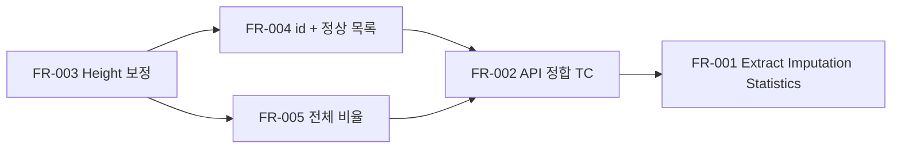

# SHealth BMI — 신규 기능 개발 요구사항 보고서

**문서 역할:** 고객 미팅 결과를 바탕으로 한 SW 신규 개발 요구사항 정의서 (SRS)  
**기준 문서:** [README.md](../README.md) §4 기능 개선, [Refactoring_result_report.md](./Refactoring_result_report.md)  
**대상 브랜치:** `feature` (베이스: `tc`)  
**작성일:** 2026-05-20  
**버전:** 1.1 (고객 회신 반영 · 요구사항 동결)  
**상태:** §12 고객 확인 완료 · **구현 착수 가능**

---

## 0. 고객 결정 요약 (v1.1)

| ID | 결정 |
|----|------|
| Q-01 | Height 보정 대상 decade에 **유효 키(height≠0)가 없으면** 예외 발생 + 사용자에게 **유효 키 없음** 메시지 전달 |
| Q-02 | 보정 순서: **체중 → 키** (확정) |
| Q-03 | CSV `id` → `HealthRecord.id` **저장** |
| Q-04 | 정상 BMI = **(18.5, 23)** / `BmiCategory::Normal` **확정** |
| Q-05 | SRP **옵션 B** — `Imputation` / `Statistics` 역할 **Extract Class** (별도 헤더·함수) |
| Q-06 | 무인원 연령대 조회 시 4비율 **0%** 반환 (`nullopt` 아님) |
| Q-07 | 신규·연령대별 결과 **CLI 출력 추가** |
| Q-08 | **정렬하지 않음** — `filterNormalUserIds` 반환 순서 = **CSV 입력 순** |
| Q-09 | 전체 인구 비율·집계 시 **로드된 모든 레코드** 포함 (19·80세 포함) |
| Q-10 | **개발팀 재량** — public 노출·호출 시점·오케스트레이션 방식은 구현 시 최선 선택 (§7.1) |

---

## 1. 문서 목적

본 문서는 개발 의뢰 고객이 제안한 README 4단계(기능 개선) 5개 항목을 **검증 가능한 소프트웨어 요구사항**으로 구조화한 것이다. CS 담당자가 고객 미팅에서 수집한 내용을 개발·QA·인수 테스트가 공통으로 참조할 수 있도록 한다.

| 대상 독자 | 활용 목적 |
|-----------|-----------|
| 개발 | 구현 범위·API·파이프라인 순서 확정 |
| QA | [Test_requirements_analysis_report.md](./Test_requirements_analysis_report.md) 4단계 TC 보완 |
| 고객 | §12 확인 사항 회신 → 요구사항 동결 |

---

## 2. 미팅 요약

### 2.1 고객 제안 원문 (README §4)

| # | 고객 제안 항목 |
|---|----------------|
| 1 | SRP에 따른 책임 분리 등 리팩토링 |
| 2 | 특정 연령대의 BMI 분포 비율 계산 기능 추가 |
| 3 | Height가 0인 경우에 대한 평균치 보정 로직 추가 |
| 4 | BMI 정상 범위 사용자 목록 조회 기능 추가 |
| 5 | 전체 사용자 대비 각 BMI 범주 비율 계산 기능 추가 |

### 2.2 CS 정리 — 핵심 비즈니스 맥락 (README Overview 재확인)

| ID | 비즈니스 규칙 | 출처 |
|----|---------------|------|
| BR-01 | 연령대(20·30·…·70대)별 저체중/정상/과체중/비만 **비율(%)** 산출 | README Overview |
| BR-02 | **체중 0** = 누락 → 동일 연령대(10년 단위) **평균 체중**으로 대체 | README Overview |
| BR-03 | BMI = 체중(kg) / 키(m)² | README Overview |
| BR-04 | 분류: ≤18.5 저체중 · (18.5, 23) 정상 · [23, 25) 과체중 · **≥25 비만** | README Overview |
| BR-05 | 입력: CSV `id,age,weight,height` | README data sample |

### 2.3 현행 구현 상태 (미팅 시점)

P0~P2 리팩토링이 완료된 상태이며, README 4단계용 API 시그니처는 **예약(stub)** 되어 있다.

| 고객 항목 | 현행 | 갭(Gap) |
|-----------|------|---------|
| 1. SRP 리팩토링 | 파이프라인·Reader 분리 완료 | **옵션 B:** `Imputation` / `Statistics` Extract (Q-05) |
| 2. 연령대별 BMI 분포 | 집계·API 존재 | 무인원 **0%** (Q-06) · **CLI 출력** (Q-07) |
| 3. Height 0 보정 | **stub** | 구현 + 유효 키 없을 시 **예외·메시지** (Q-01) |
| 4. 정상 BMI 사용자 목록 | **stub**, id 미저장 | `id` 저장 (Q-03) · 정상 범위 확정 (Q-04) |
| 5. 전체 대비 BMI 비율 | **stub** | **전체 로드 레코드** 집계 (Q-09) |

---

## 3. 요구사항 식별자 체계

| 접두사 | 의미 |
|--------|------|
| **FR-** | 기능 요구사항 (Functional Requirement) |
| **NFR-** | 비기능 요구사항 |
| **AC-** | 인수 조건 (Acceptance Criteria) |
| **Q-** | 고객 확인 필요 (Open Question) |

---

## 4. 기능 요구사항

### FR-001 — SRP 기반 책임 분리 (리팩토링)

**설명:** 신규 기능(키 보정·사용자 필터·전체 통계) 추가 시 `SHealth` God Class 재발을 방지하기 위해 단일 책임 원칙에 맞게 모듈 경계를 정비한다.

**현행 달성분 (인수 기준으로 이미 충족된 항목):**

- I/O(`IHealthRecordReader` / `CsvHealthRecordReader`)와 도메인 계산(`namespace bmi`) 분리
- `calculateBmi` / `loadAndAnalyze`는 **오케스트레이션**만 수행
- 연령대별 4비율은 `aggregateByAgeGroup` 단일 책임

**본 스프린트 범위 (Q-05 확정 — 옵션 B):**

| 모듈 | 책임 | 예상 파일 |
|------|------|-----------|
| **Imputation** | `imputeMissingWeights`, `imputeMissingHeights` (연령대별 평균 대체) | `Imputation.h` / `Imputation.cpp` |
| **Statistics** | `aggregateByAgeGroup`, `overallPopulationRatios`, `distributionForAgeGroup` 데이터 산출 | `Statistics.h` / `Statistics.cpp` |
| **SHealth** | Reader 주입·파이프라인 오케스트레이션·공개 API 위임 | `SHealth.h` / `SHealth.cpp` |

`namespace bmi` 순수 함수(`computeBmi`, `classifyBmi` 등)는 기존 `BmiLogic` 유지.

**필수 제약:**

- 기존 공개 API 하위 호환: `calculateBmi`, `getBmiRatio` 동작 유지 ([Refactoring_result_report.md](./Refactoring_result_report.md) §8)
- 파이프라인 단계 순서 변경 시 **골든 스냅샷** (`shealth.dat` 24비율) 영향 분석 필수

**우선순위:** P1 (다른 FR 구현의 전제 구조)

---

### FR-002 — 특정 연령대 BMI 분포 비율 조회

**설명:** 지정한 연령대(20·30·40·50·60·70대)에 대한 4개 BMI 범주 비율(%)을 조회한다.

**현행:** `aggregateByAgeGroup` 후 `distributions_`에 저장 · `getRatio(AgeGroup, BmiCategory)`, `distributionForAgeGroup(AgeGroup)`로 조회 가능.

**본 스프린트 요구 (CS 해석):**

| ID | 요구 내용 |
|----|-----------|
| FR-002-1 | `distributionForAgeGroup` — 해당 연령대 **인원 0명**이면 4비율 **0, 0, 0, 0** 반환 (Q-06, `nullopt` 사용 안 함) |
| FR-002-2 | 인원 ≥1인 연령대: 4비율 합계 **100% ± ε** (ε = 1e-3) |
| FR-002-3 | `SHealthBMI.cpp` CLI에 **6개 연령대 전부** 분포 출력 (Q-07) — 기존 20~70대 리포트와 형식 통일 |
| FR-002-4 | Height 보정 실패(유효 키 없음) 시 FR-003 예외 정책과 충돌 없도록, 집계 전 파이프라인에서 처리 |

**입력:** `bmi::AgeGroup` (enum)  
**출력:** `bmi::BmiDistribution` (무인원 연령대도 **항상 값 반환**, 0%) — API 시그니처는 구현 시 `optional` 제거 또는 0% 채워 반환하도록 정합

**우선순위:** P2 (핵심 로직 존재 → 문서화·TC·정책 정합)

---

### FR-003 — Height 0 평균치 보정

**설명:** 키(cm)가 **0**인 레코드는 누락으로 간주하고, **동일 연령대(10년 단위)** 내 키가 0이 아닌 레코드들의 **평균 키**로 대체한다. (체중 0 보정과 대칭 — BR-02 확장)

**상세 규칙 (CS 제안 — BR-02 대칭):**

| ID | 규칙 |
|----|------|
| FR-003-1 | 연령대 판별: `bmi::inAgeDecade(age, decade)` — 기존 체중 보정과 동일 |
| FR-003-2 | 평균 산출: 해당 decade에서 `height != 0` 인 레코드만 합산·개수 |
| FR-003-3 | 대체 대상: `height == 0` 인 레코드에 평균 할당 |
| FR-003-4 | 해당 decade에 `height==0` 보정이 필요한데 유효 키(`height≠0`)가 **0건**이면 **예외** 발생 (Q-01) |
| FR-003-5 | 예외 시 사용자 메시지: 유효 키 없음을 알림 (예: `"No valid height in age group {decade}"` — `stderr` 또는 `std::runtime_error::what()`) |
| FR-003-6 | 보정은 `computeBmis()` **이전**에 수행 |
| FR-003-7 | `loadAndAnalyze`는 예외 전파 또는 오류 코드 반환 정책 중 하나로 통일 (구현 시 `int` 반환값 확장 검토) |

**파이프라인 (확정안 — Q-02와 연동):**

```text
loadRecords
  → imputeMissingWeights
  → imputeMissingHeights    ← 신규
  → computeBmis
  → aggregateByAgeGroup
```

**동시 누락 (Q-02 확정):** `weight==0` 이고 `height==0` 인 레코드  
→ **1차** `imputeMissingWeights` → **2차** `imputeMissingHeights` (키 평균은 `height` 필드만 사용)

**우선순위:** P0 (height=0 시 BMI inf/nan 결함 제거)

---

### FR-004 — BMI 정상 범위 사용자 ID 목록 조회

**설명:** 분류 결과가 **정상체중**인 사용자의 ID 목록을 반환한다.

**정상 범위 (BR-04):** BMI **초과 18.5** 이고 **23 미만** — 구현상 `classifyBmi` → `BmiCategory::Normal`

| ID | 요구 내용 |
|----|-----------|
| FR-004-1 | `filterNormalUserIds()` public API 제공 |
| FR-004-2 | `loadAndAnalyze()` 완료 후(보정·BMI·집계 후) 호출 시 일관된 결과 |
| FR-004-3 | `HealthRecord.id`에 CSV **id** 저장 (Q-03 확정) |
| FR-004-4 | 반환 타입: `std::vector<int>` (id 정수형, CSV와 동일) |
| FR-004-5 | 반환 순서: **CSV 입력 순**, **정렬하지 않음** (Q-08 확정) |
| FR-004-6 | (Q-07) CLI에 정상 사용자 ID 목록 출력 **허용** — 건수 많을 경우 요약+샘플은 구현 재량 |

**전제 조건:** FR-003 반영 후 BMI가 유효한 레코드만 분류 대상

**우선순위:** P1 (id 필드 추가 후 구현)

---

### FR-005 — 전체 사용자 대비 BMI 범주 비율

**설명:** **연령대 구분 없이** 로드된 전체 레코드를 대상으로 4개 BMI 범주 비율(%)을 산출한다.

| ID | 요구 내용 |
|----|-----------|
| FR-005-1 | `overallPopulationRatios()` → `std::optional<bmi::BmiDistribution>` |
| FR-005-2 | 분모: `records_` **전체** (19·80세 등 연령대 필터 **없음**, Q-09 확정) |
| FR-005-6 | (Q-07) CLI에 전체 인구 4비율 출력 |
| FR-005-3 | 분자: `classifyBmi(record.bmi)` 기준 카운트 |
| FR-005-4 | 4비율 합계 100% ± ε |
| FR-005-5 | 레코드 0건 시 `std::nullopt` |

**FR-002와의 차이:**

| 구분 | FR-002 | FR-005 |
|------|--------|--------|
| 집계 단위 | 연령대별 (6그룹) | 전체 1그룹 |
| API | `distributionForAgeGroup` / `getRatio` | `overallPopulationRatios` |

**우선순위:** P1

---

## 5. 비기능 요구사항

| ID | 요구사항 |
|----|----------|
| NFR-01 | C++17, CMake 3.10+, 기존 빌드·`ctest` 구조 유지 |
| NFR-02 | STL 사용 허용 (README 주의 사항) |
| NFR-03 | 기존 `shealth.dat` 골든 24비율 **회귀 없음** (height=0 레코드 없을 시) |
| NFR-04 | 부동소수점 비교: BMI ε=1e-4, 비율 ε=1e-5 ([Test_requirements_analysis_report.md](./Test_requirements_analysis_report.md) §3.3) |
| NFR-05 | 최대 레코드 수 `kMaxRecords` (10,000) 준수 |
| NFR-06 | 신규·변경 public API에 `[[nodiscard]]` 유지 (기존 코드 스타일) |

---

## 6. 데이터 모델 변경

### 6.1 `HealthRecord` 확장 (FR-004 전제)

**현행:**

```cpp
struct HealthRecord {
    int age = 0;
    double weight = 0.0;
    double height = 0.0;
    double bmi = 0.0;
};
```

**변경안:**

```cpp
struct HealthRecord {
    int id = 0;           // NEW — CSV column 0
    int age = 0;
    double weight = 0.0;
    double height = 0.0;
    double bmi = 0.0;
};
```

**영향:** `CsvHealthRecordReader`에서 `tokens[0]` 파싱 · 테스트 fixture `makeRecord` 시그니처 · 골든 테스트 (id 미사용 시 수치 불변)

---

## 7. API 명세 (목표)

| API | 상태 | FR |
|-----|------|-----|
| `int loadAndAnalyze()` | 유지 | — |
| `std::optional<double> getRatio(AgeGroup, BmiCategory)` | 유지 | FR-002 |
| `std::optional<BmiDistribution> distributionForAgeGroup(AgeGroup)` | 동작 정합·문서화 | FR-002 |
| `void imputeMissingHeights()` | **구현** | FR-003 |
| `std::vector<int> filterNormalUserIds()` | **구현** | FR-004 |
| `std::optional<BmiDistribution> overallPopulationRatios()` | **구현** | FR-005 |
| `double getBmiRatio(int, int)` | deprecated 유지 | NFR-03 |

**오류 처리 (Q-01):** 유효 키 없음 → `std::runtime_error` 또는 동등 메커니즘 + 사용자 가독 메시지.

### 7.1 `imputeMissingHeights` 호출 방식 (Q-10 — 개발팀 재량)

고객이 구현 세부를 개발팀에 위임함. 아래 중 **하나 이상**을 만족하면 됨.

| 권장안 | 설명 |
|--------|------|
| **A** | `loadAndAnalyze` 내부에서 `imputeMissingWeights` 직후 자동 호출 (현행 파이프라인 확장) |
| **B** | `public void imputeMissingHeights()` 유지 + 문서화된 선행 조건(`loadRecords` 완료) 하에 단독 호출 허용 |

**필수:** Q-02 순서(체중 → 키) 및 FR-003 예외 정책은 어느 방식이든 동일하게 적용.

---

## 8. 인수 조건 (Acceptance Criteria)

| ID | 조건 | 검증 방법 |
|----|------|-----------|
| AC-01 | FR-003: 동일 decade 내 height=0 레코드가 non-zero 평균으로 대체됨 | 단위·통합 TC (Test plan TC-P2 계열) |
| AC-02 | FR-003: 유효 키 존재 시 height=0 보정 후 inf/nan **없음** | TC-U-06 활성화 |
| AC-02b | FR-003: 유효 키 0건 decade → **예외 + 메시지** | TC-P2 예외 TC |
| AC-05b | FR-002: 무인원 연령대 `distributionForAgeGroup` → **0,0,0,0** | TC-I-08 갱신 |
| AC-09 | FR-002/005: CLI에 6연령대 + 전체 비율 출력 | 수동·스냅샷 |
| AC-03 | FR-004: 정상 BMI 사용자 id 목록이 BR-04와 일치 | fixture CSV + 기대 id 집합 |
| AC-04 | FR-005: 전체 4비율 합 ≈ 100% | 통합 TC |
| AC-05 | FR-002: 6연령대 각 `distributionForAgeGroup` 합 ≈ 100% | TC-I-08 |
| AC-06 | `shealth.dat` 기존 24비율 골든 **불변** (데이터에 height=0 없을 때) | TC-G-01 |
| AC-07 | `ctest` 전체 통과 | CI / 로컬 `ctest` |
| AC-08 | README §4 5항목 구현 완료 체크리스트 고객 서명 | 본 문서 §11 |

---

## 9. 요구사항 추적 매트릭스

| 고객 제안 | FR | 구현 파일(예상) | 테스트 (기존 계획) |
|-----------|-----|-----------------|-------------------|
| SRP 리팩토링 | FR-001 | `Imputation.*`, `Statistics.*`, `SHealth.*` | 파이프라인 통합 TC |
| 연령대별 BMI 분포 | FR-002 | `Statistics.*`, `SHealthBMI.cpp` | TC-I-04, TC-I-08, TC-G-01 |
| Height 0 보정 | FR-003 | `Imputation.*` | TC-P2-*, 예외 TC |
| 정상 BMI 사용자 목록 | FR-004 | `SHealthTypes.h`, `CsvHealthRecordReader.cpp` | TC-P2-* |
| 전체 BMI 비율 | FR-005 | `Statistics.*`, `SHealthBMI.cpp` | TC-P2-* |

---

## 10. 구현 우선순위 (CS 제안)



| 순서 | FR | 예상 공수 (README 기준 2h 내) |
|------|-----|-------------------------------|
| 1 | FR-003 | 30분 |
| 2 | FR-004 (+ id 모델) | 40분 |
| 3 | FR-005 | 20분 |
| 4 | FR-002 정합·TC | 15분 |
| 5 | FR-001 (옵션 B Extract) | 잔여 |

---

## 11. 범위 외 (Out of Scope)

| 항목 | 사유 |
|------|------|
| 웹/UI·DB 연동 | 콘솔 배치·라이브러리 범위 |
| 19·80세를 **연령대 집계 배열**에 신규 슬롯 추가 | 6연령대(20~70) 체계 유지; FR-005만 전체 레코드 포함 |
| P3 스타일 (C 캐스트 제거, iostream 통일) | 별도 스프린트 |
| 유효 키 없을 때 **임의 기본값**으로 조용히 보정 | Q-01: **예외·메시지**로 대체 |

---

## 12. 고객 확인 사항 (동결)

### 12.1 고객 회신 기록

| ID | 회신일 | 결정 | 비고 |
|----|--------|------|------|
| Q-01 | 2026-05-20 | **예외 + 메시지** | 특정 연령대 BMI 산출·보정 시 해당 decade에 **유효 키 없음** → 사용자에게 알림. 무인원 연령대 **조회만** 할 때는 Q-06(0%)과 구분 |
| Q-02 | 2026-05-20 | **체중 → 키** | 권장안 확정 |
| Q-03 | 2026-05-20 | **저장** | `HealthRecord.id` |
| Q-04 | 2026-05-20 | **(18.5, 23) 확정** | `classifyBmi::Normal` |
| Q-05 | 2026-05-20 | **옵션 B** | `Imputation` / `Statistics` Extract |
| Q-06 | 2026-05-20 | **0% 4필드** | `distributionForAgeGroup` 무인원 |
| Q-07 | 2026-05-20 | **CLI 출력 OK** | 6연령대·전체 비율 등 |
| Q-08 | 2026-05-20 | **정렬 안 함** | CSV 입력 순 그대로 |
| Q-09 | 2026-05-20 | **전체 레코드** | 19·80세 포함, 모든 연령대 비율 반영 |
| Q-10 | 2026-05-20 | **개발팀 재량** | §7.1 참고 |

### 12.2 Q-01 vs Q-06 정책 구분 (구현 필수)

| 상황 | 동작 |
|------|------|
| 연령대 **인원 0명** (집계·조회) | 4비율 **0, 0, 0, 0** 반환, 예외 없음 (Q-06) |
| 연령대에 레코드 있으나 **height=0 보정 필요** + 유효 키 0건 | **예외** + “유효 키 없음” 메시지 (Q-01) |

---

## 13. 리스크

| ID | 리스크 | 완화 |
|----|--------|------|
| R-F01 | id 필드 추가로 테스트·fixture 전면 수정 | Q-03 확정 후 일괄 커밋 |
| R-F02 | Height 보정 후 골든 24비율 변동 | `shealth.dat`에 height=0 없으면 불변; 있으면 기대값 재산정 |
| R-F03 | FR-002 CLI 추가로 출력 형식 변경 | 기존 20~70 리포트 유지 + 신규 섹션 추가 |
| R-F04 | Q-01 예외로 `loadAndAnalyze` 실패 경로 증가 | TC-P2 예외·메시지 검증 |
| R-F05 | Q-01 vs Q-06 경계 혼동 | §12.2 표준 준수 |

---

## 14. 요약

- **v1.1** 고객 회신 반영 완료 — **구현 착수 가능**.
- **FR-003:** 키 보정 + 유효 키 없을 시 **예외·사용자 메시지** (Q-01).
- **FR-002/006:** 무인원 연령대 **0%** · **CLI 출력** (Q-06, Q-07).
- **FR-004/005:** `id` 저장 · 정상 범위 확정 · 전체 레코드 집계 (Q-03, Q-04, Q-09).
- **FR-001:** `Imputation` / `Statistics` Extract Class (Q-05 옵션 B).
- Q-08: ID 목록 **정렬 없음** · Q-10: `imputeMissingHeights` 호출 방식 **개발팀 재량** (§7.1).

---

*본 문서 v1.1 — CS–고객 미팅 산출물. 추가 변경 시 버전·§12.1 갱신.*
