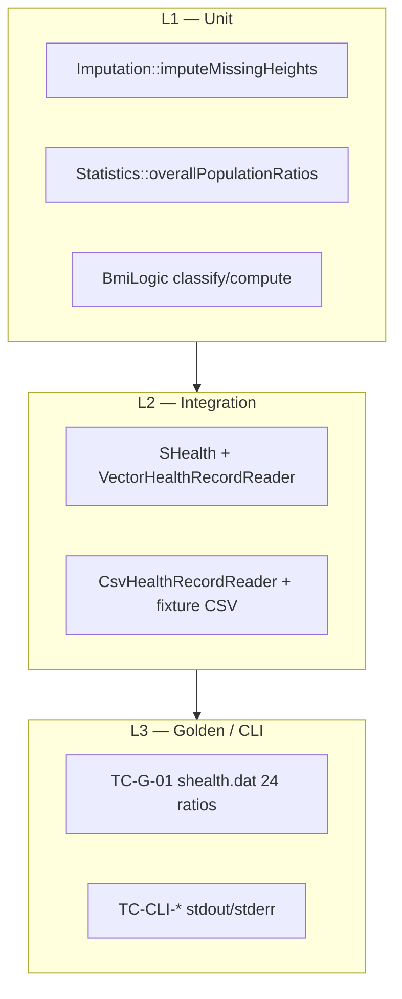
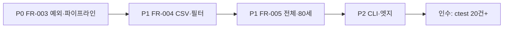

# SHealth BMI — 신규 기능 테스트 계획서

**문서 역할:** README 4단계(기능 개선) FR-001~FR-005에 대한 QA 테스트 계획  
**기준 문서:** [Feature_requirements_report.md](./Feature_requirements_report.md) v1.1, [Feature_implementation_result_report.md](./Feature_implementation_result_report.md)  
**연계 문서:** [Test_requirements_analysis_report.md](./Test_requirements_analysis_report.md) (ε·BVA·TC-U/I/G 체계), [Refactoring_result_report.md](./Refactoring_result_report.md)  
**구현 대상:** `src/test/cpp/SHealthBMITest.cpp`, `src/test/cpp/TestFixtures.h`, `ctest`  
**작성일:** 2026-05-20  
**상태:** 구현 완료(7/7 gtest 통과) · **추가 TC 23건 계획** (본 문서)

---

## 1. 문서 목적

[Feature_requirements_report.md](./Feature_requirements_report.md)의 인수 조건(AC-01~AC-09)과 [Feature_implementation_result_report.md](./Feature_implementation_result_report.md)에 기술된 구현 산출물을 검증하기 위한 **테스트 계획**을 정의한다.

| 대상 독자 | 활용 목적 |
|-----------|-----------|
| QA | TC 설계·수동 검증·인수 테스트 체크리스트 |
| 개발 | gtest 구현 우선순위·fixture 설계 |
| 고객 | §12 고객 결정(Q-01~Q-10) 대비 검증 범위 확인 |

**본 문서와 [Test_requirements_analysis_report.md](./Test_requirements_analysis_report.md)의 관계**

| 문서 | 범위 |
|------|------|
| Test_requirements_analysis_report | 리팩토링(P0~P2)·README 3단계 · TC-U/I/C/G |
| **본 문서 (Feature_test_plan)** | README 4단계 · FR-001~005 · **TC-F** 계열 |

---

## 2. 테스트 목표

| 목표 | 설명 | 대응 FR |
|------|------|---------|
| **보정 정확성** | Height 0 → 연령대 평균 대체, 체중→키 순서, 예외·메시지 | FR-003 |
| **분류·필터** | 정상 BMI (18.5, 23), id 저장·CSV 순 반환 | FR-004 |
| **집계 정합** | 연령대별 0%/100%, 전체 인구(19·80세 포함) | FR-002, FR-005 |
| **구조·회귀** | Imputation/Statistics 분리, 골든 24비율 불변 | FR-001, NFR-03 |
| **사용자 경험** | CLI 신규 섹션·오류 exit 1 | Q-07, FR-003 |

---

## 3. 테스트 범위

### 3.1 In Scope

| 영역 | 검증 대상 | 모듈/파일 |
|------|-----------|-----------|
| Unit | `imputation::imputeMissingHeights`, `statistics::overallPopulationRatios` | `Imputation.cpp`, `Statistics.cpp` |
| Integration | `SHealth::loadAndAnalyze` 파이프라인(체중→키→BMI→집계), 공개 API | `SHealth.cpp` |
| Component | CSV `id` 파싱 | `CsvHealthRecordReader.cpp` |
| Golden | `shealth.dat` 6연령대 × 4비율 (height=0 없음 → 불변) | `SHealthGoldenTest` |
| Manual/E2E | CLI `overall`·`normal users`·예외 stderr | `SHealthBMI.cpp` |

### 3.2 Out of Scope

| 항목 | 사유 |
|------|------|
| 웹/UI·DB | 요구사항 §11 범위 외 |
| 19·80세 **연령대 슬롯** 추가 | 6연령대 체계 유지; FR-005만 전체 포함 |
| P3 스타일(C 캐스트, iostream 통일) | 별도 스프린트 |
| 유효 키 없을 때 **조용한 기본값** 보정 | Q-01: 예외 정책 — TC-F-03b로만 검증 |

### 3.3 부동소수점 허용 오차 (전 TC 공통)

[Test_requirements_analysis_report.md](./Test_requirements_analysis_report.md) §3.3과 동일.

| 비교 대상 | ε | Google Test |
|-----------|---|-------------|
| BMI 값 | `1e-4` | `EXPECT_NEAR(..., 1e-4)` |
| 비율(%) | `1e-5` | `EXPECT_NEAR(..., 1e-5)` |
| 4비율 합 | `1e-3` | `EXPECT_NEAR(sum, 100.0, 1e-3)` |

---

## 4. 현행 구현·테스트 기준선 (Baseline)

### 4.1 구현 상태 (2026-05-20)

[Feature_implementation_result_report.md](./Feature_implementation_result_report.md) 기준 **FR-001~FR-005 구현 완료**, `ctest` **7/7 통과**.

**확정 파이프라인 (Q-02, Q-10 옵션 A):**

```text
loadRecords
  → imputation::imputeMissingWeights
  → imputation::imputeMissingHeights
  → computeBmis
  → statistics::aggregateByAgeGroup
```

### 4.2 이미 구현된 gtest (7건)

| gtest 이름 | TC-ID (본 문서) | FR/AC | 검증 요약 |
|------------|-----------------|-------|-----------|
| `BmiLogicTest.ClassifyBoundaryValues` | TC-F-04a | FR-004, Q-04 | 18.5/23/25 분류 경계 |
| `ImputationTest.ImputeMissingHeightsReplacesZero` | TC-F-03a | FR-003, AC-01 | height=0 → 평균 175 |
| `ImputationTest.ImputeMissingHeightsThrowsWhenNoValidHeight` | TC-F-03b | FR-003, AC-02b, Q-01 | `runtime_error` |
| `SHealthTest.EmptyAgeGroupReturnsZeroRatios` | TC-F-02a | FR-002, Q-06, AC-05b | 20대 무인원 → 0%×4 |
| `SHealthTest.FilterNormalUserIdsPreservesCsvOrder` | TC-F-04c | FR-004, Q-08 | id 300, 200 순서 |
| `SHealthTest.OverallPopulationIncludesAllAges` | TC-F-05a | FR-005, Q-09 | 19세 포함·합 100% |
| `SHealthGoldenTest.ShealthDatSnapshot` | TC-G-01 | NFR-03, AC-06 | 골든 24비율 |

### 4.3 커버리지 갭 요약

| 구분 | 계획 TC | 구현 | 미구현 |
|------|---------|------|--------|
| TC-F (신규 기능) | 23 | 6 | **17** |
| TC-G-01 (골든) | 1 | 1 | 0 |
| TC-CLI (수동) | 4 | 0 (수동만) | 4 |
| **합계** | **28** | **7 자동 + 수동** | **21** |

---

## 5. 테스트 전략

### 5.1 테스트 피라미드 (기능 스프린트)



### 5.2 Q-01 vs Q-06 경계 (필수 구분 TC)

[Feature_requirements_report.md](./Feature_requirements_report.md) §12.2 — **혼동 시 치명적 결함**.

| 상황 | 기대 동작 | 대표 TC |
|------|-----------|---------|
| 연령대 **집계 인원 0** (조회만) | `distributionForAgeGroup` → **0,0,0,0**, 예외 없음 | TC-F-02a ✅, TC-F-02b |
| decade에 레코드 있으나 **height=0 보정 필요** + 유효 키 0건 | **`std::runtime_error`** + 메시지 | TC-F-03b ✅, TC-F-03c |

### 5.3 파이프라인 회귀 포인트

순서·모듈 추출 변경 시 **TC-G-01**이 1차 방어선. Height 보정이 들어간 데이터셋은 별도 fixture로 골든 분리 권장(TC-F-03g).

---

## 6. 입력 경계값 분석 (BVA) — 신규 기능

### 6.1 Height 보정 (`imputeMissingHeights`)

| 시나리오 | 20대 레코드 (age, height) | 유효 n | 평균 | 보정 후 height | TC |
|----------|---------------------------|--------|------|----------------|-----|
| 정상 보정 | (25,170), (25,0), (25,180) | 2 | 175 | 0→175 | TC-F-03a ✅ |
| 단일 유효 | (25,170), (25,0) | 1 | 170 | 0→170 | TC-F-03d |
| 유효 0건 + 보정 필요 | (25,0), (25,0) | 0 | — | **예외** | TC-F-03b ✅ |
| 보정 대상 없음 | (25,170)만 | — | — | 변경 없음 | TC-F-03e |
| 타 연령대 혼합 | 20대 (25,0),(25,170), 30대 (35,0) | 20대만 | 170 | decade별 독립 | TC-F-03f |
| **체중·키 동시 0** | (25, w=0,h=0), (25, w=50,h=170) | — | w→50 후 h→170 | Q-02 순서 | TC-F-03g |

### 6.2 정상 BMI 필터 (`filterNormalUserIds`)

| BMI (역산 예, h=170cm) | 분류 | 목록 포함 | TC |
|------------------------|------|-----------|-----|
| 18.5 | Underweight | ✗ | TC-F-04b |
| 18.5 + ε | Normal | ✓ | TC-F-04b |
| 22.99 | Normal | ✓ | TC-F-04a ✅ (간접) |
| 23.0 | Overweight | ✗ | TC-F-04b |
| 경계 혼합 3건 | 1 Normal | 순서·개수 | TC-F-04c ✅ |

### 6.3 전체 인구 비율 (`overallPopulationRatios`)

| records 구성 | 기대 | TC |
|--------------|------|-----|
| empty | `nullopt` | TC-F-05b |
| 19세 1명 + 25세 1명 | 분모 2, 19세 **포함** | TC-F-05a ✅ |
| 80세 1명 + 25세 1명 | 분모 2, 80세 **포함** | TC-F-05c |
| 1명 Normal 100% | 한 카테고리 100% | TC-F-05d |

### 6.4 연령대별 분포 (FR-002)

| 조건 | `distributionForAgeGroup` | TC |
|------|---------------------------|-----|
| 해당 decade 인원 ≥1 | 4비율 합 ≈ 100% | TC-F-02c, TC-G-01 |
| 해당 decade 인원 0 | 0,0,0,0 | TC-F-02a ✅ |
| 6 decade 전부 | 골든 24값 | TC-G-01 ✅ |

### 6.5 CSV `id` (FR-004 전제)

| 입력 | Then | TC |
|------|------|-----|
| `1,25,70.0,170.0` | `record.id == 1` | TC-F-04e |
| 헤더 + 정상 1행 | size=1, id 파싱 | TC-F-04e |

---

## 7. 테스트 케이스 상세 명세 (TC-F)

테스트 구현 시 **gtest 이름에 TC-ID 접미사** 권장 (예: `ImputeMissingHeights_TC_F_03a`).

### 7.1 FR-001 — 책임 분리·회귀

#### TC-F-01a: 파이프라인 골든 불변 (회귀)

| 항목 | 내용 |
|------|------|
| **Given** | 프로젝트 루트 `shealth.dat` (height=0 레코드 없음) |
| **When** | `SHealth::calculateBmi("shealth.dat")` |
| **Then** | return > 0; 6연령대 24비율 `EXPECT_NEAR` (ε=1e-5) — **TC-G-01과 동일** |
| **상태** | ✅ `SHealthGoldenTest.ShealthDatSnapshot` |

#### TC-F-01b: `getBmiRatio` / `getRatio` 하위 호환

| Given | When | Then |
|-------|------|------|
| TC-F-01a 이후 shealth | `getBmiRatio(20, 100)` 등 legacy | 골든 `distributionForAgeGroup` 값과 일치 (ε=1e-5) |
| **상태** | ⏭️ 미구현 |

#### TC-F-01c: Imputation/Statistics 단독 링크

| Then | `ImputationTest`, `Statistics` 직접 호출 컴파일·실행 성공 (간접: TC-F-03*, TC-F-05* Unit) |
| **상태** | 🔶 TC-F-03a,b로 Imputation만 부분 검증 |

---

### 7.2 FR-003 — Height 0 보정

#### TC-F-03a: 동일 decade 평균 대체

| 항목 | 내용 |
|------|------|
| **Given** | id=1,2,3 / ages 25,27,28 / heights 170, **0**, 180 |
| **When** | `imputation::imputeMissingHeights(records)` |
| **Then** | id=2 `height == 175.0` |
| **상태** | ✅ |

#### TC-F-03b: 유효 키 0건 → 예외

| Given | When | Then |
|-------|------|------|
| 20대 전원 height=0 | `imputeMissingHeights` | `std::runtime_error` |
| **상태** | ✅ |

#### TC-F-03c: 예외 메시지 내용 (Q-01)

| When | Then |
|------|------|
| TC-F-03b | `ex.what()`에 `"No valid height"` 및 decade `"20"` 포함 |
| **상태** | ⏭️ |

#### TC-F-03d: 단일 유효 키로 보정

| Given | When | Then |
|-------|------|------|
| (25,170), (25,0) | impute | 0→170 |
| **상태** | ⏭️ |

#### TC-F-03e: 보정 대상 없으면 no-op

| Given | When | Then |
|-------|------|------|
| height 모두 non-zero | impute | 레코드 바이트 동일 |
| **상태** | ⏭️ |

#### TC-F-03f: 연령대별 독립 보정

| Given | When | Then |
|-------|------|------|
| 20대 (25,0)+(25,170); 30대 (35,0)+(35,165) | impute | 20대→170, 30대→165 |
| **상태** | ⏭️ |

#### TC-F-03g: 체중→키 동시 누락 (Q-02)

| Given | When | Then |
|-------|------|------|
| (25, w=0,h=0), (25, w=60,h=170) | `loadAndAnalyze()` | w→60, h→170; BMI 유한값; **inf/nan 없음** |
| **상태** | ⏭️ (AC-02, 기존 TC-U-06 활성화 권장) |

#### TC-F-03h: `loadAndAnalyze` 예외 전파

| Given | When | Then |
|-------|------|------|
| VectorReader: 20대 height 전원 0 | `shealth.loadAndAnalyze()` | `EXPECT_THROW`, 메시지 TC-F-03c |
| **상태** | ⏭️ |

#### TC-F-03i: `SHealth::imputeMissingHeights` public 단독 호출 (Q-10 옵션 B)

| Given | When | Then |
|-------|------|------|
| `loadRecords()`만 수행 후 records에 TC-F-03a fixture | `imputeMissingHeights()` | TC-F-03a와 동일 |
| **상태** | ⏭️ |

---

### 7.3 FR-002 — 연령대별 BMI 분포

#### TC-F-02a: 무인원 연령대 0%

| Given | When | Then |
|-------|------|------|
| 19세만 (20대 무인원) | `distributionForAgeGroup(Decade20)` | 0,0,0,0 |
| **상태** | ✅ |

#### TC-F-02b: 무인원 vs 예외 구분 (회귀)

| Given | When | Then |
|-------|------|------|
| TC-F-02a | `loadAndAnalyze()` | **예외 없음**, return > 0 |
| **상태** | 🔶 TC-F-02a에 포함, 명시 TC 권장 |

#### TC-F-02c: 인원 ≥1 연령대 4비율 합 100%

| Given | When | Then |
|-------|------|------|
| 20대 2명 Normal fixture | analyze | `distributionForAgeGroup` 4필드 합 ≈ 100% |
| **상태** | ⏭️ (기존 TC-I-04와 동일 패턴) |

#### TC-F-02d: 6연령대 각 합 100% (골든)

| Given | When | Then |
|-------|------|------|
| `shealth.dat` | 6 group | 각 decade 합 ≈ 100% |
| **상태** | 🔶 TC-G-01이 개별 값으로 간접 검증 |

---

### 7.4 FR-004 — 정상 BMI 사용자 ID

#### TC-F-04a: 분류 경계 (BmiLogic)

| Then | 18.5→Underweight, 18.5001→Normal, 23.0→Overweight |
| **상태** | ✅ `ClassifyBoundaryValues` |

#### TC-F-04b: 필터에 경계 사용자 제외/포함

| Given | When | Then |
|-------|------|------|
| 3명: BMI Under/Normal/Over (동일 h, 역산 weight) | `filterNormalUserIds()` | size=1, 해당 id만 |
| **상태** | ⏭️ |

#### TC-F-04c: CSV 입력 순, 정렬 없음 (Q-08)

| Given | When | Then |
|-------|------|------|
| id 300,100,200 / 2명 Normal | filter | `[300, 200]` |
| **상태** | ✅ |

#### TC-F-04d: `loadAndAnalyze` 전 호출 시 빈 목록

| When | Then |
|------|------|
| analyze 전 `filterNormalUserIds()` | `empty()` (또는 bmi 미계산으로 전원 비정상) |
| **상태** | ⏭️ |

#### TC-F-04e: CSV id 파싱

| Given | When | Then |
|-------|------|------|
| fixture `id,age,weight,height` / `42,25,70,170` | `CsvHealthRecordReader::read` | `records[0].id == 42` |
| **상태** | ⏭️ |

#### TC-F-04f: 정상 사용자 0명

| Given | When | Then |
|-------|------|------|
| 전원 Obesity 등 | filter | `size()==0` |
| **상태** | ⏭️ |

---

### 7.5 FR-005 — 전체 인구 BMI 비율

#### TC-F-05a: 19세 포함 (Q-09)

| Given | When | Then |
|-------|------|------|
| 19세+25세 각 1명 | `overallPopulationRatios()` | has_value; 합 ≈ 100% |
| **상태** | ✅ |

#### TC-F-05b: 레코드 0건 → nullopt

| Given | When | Then |
|-------|------|------|
| empty VectorReader | analyze 후 overall | `nullopt` |
| **상태** | ⏭️ |

#### TC-F-05c: 80세 포함

| Given | When | Then |
|-------|------|------|
| 80세 1명 + 25세 1명 | overall | 분모 2; 80세가 과체중/비만 등으로 카운트에 반영 |
| **상태** | ⏭️ |

#### TC-F-05d: 전체 vs 연령대 집계 차이

| Given | When | Then |
|-------|------|------|
| 19세 1명 + 25세 1명 | `overall` vs `distributionForAgeGroup(Decade20)` | overall 분모=2, 20대 분포 분모=1 (값 불일치 가능) |
| **상태** | ⏭️ |

#### TC-F-05e: `Statistics::overallPopulationRatios` Unit

| Given | When | Then |
|-------|------|------|
| 2 records 직접 전달 | statistics API | TC-F-05a와 동일 수치 |
| **상태** | ⏭️ |

---

### 7.6 CLI / E2E (수동·선택 자동화) — Q-07, AC-09

실행: 프로젝트 루트에서 `./build/SHealthBMI.exe` (또는 `ctest` 외부 스크립트).

#### TC-CLI-01: 정상 실행·6연령대 출력

| When | Then |
|------|------|
| `shealth.dat` 로드 | exit 0; stdout 6줄 `20`~`70` decade 형식 유지 |
| **기대 샘플** | `20 - underweight = 3.511053, ...` (구현 보고서 §5) |

#### TC-CLI-02: 전체 인구 4비율 출력 (FR-005)

| Then | stdout에 `overall - underweight =` 한 줄; 4비율 합 ≈ 100% (수동 계산) |

#### TC-CLI-03: 정상 사용자 요약 (FR-004)

| Then | `normal users count = N` (shealth.dat 기준 N≈654); `id =` 최대 20건; 초과 시 `... (more)` |

#### TC-CLI-04: Height 보정 실패 시 stderr·exit 1

| Given | height 전원 0인 테스트 CSV (별도 fixture) | When | main | Then | stderr에 `No valid height`; exit 1 |

---

## 8. 요구사항·인수 조건 추적 매트릭스

| FR/AC | 요구 요약 | 대표 TC | 자동화 상태 |
|-------|-----------|---------|-------------|
| FR-001 | Imputation/Statistics Extract | TC-F-01a~c | 🔶 골든만 ✅ |
| FR-002 | 무인원 0%, 6연령대, CLI | TC-F-02*, TC-CLI-01 | 🔶 02a ✅ |
| FR-003 | Height 보정·예외·순서 | TC-F-03* | 🔶 03a,b ✅ |
| FR-004 | id·정상 목록·순서 | TC-F-04*, TC-CLI-03 | 🔶 04a,c ✅ |
| FR-005 | 전체 레코드 4비율 | TC-F-05*, TC-CLI-02 | 🔶 05a ✅ |
| AC-01 | height=0 평균 대체 | TC-F-03a | ✅ |
| AC-02 | 보정 후 inf/nan 없음 | TC-F-03g, TC-U-06 | ⏭️ |
| AC-02b | 유효 키 0 → 예외·메시지 | TC-F-03b,c,h | 🔶 b ✅ |
| AC-03 | 정상 id BR-04 | TC-F-04b,c | 🔶 c ✅ |
| AC-04 | 전체 4비율 합 100% | TC-F-05a | ✅ |
| AC-05 | 6연령대 합 100% | TC-F-02d, TC-G-01 | 🔶 G-01 ✅ |
| AC-05b | 무인원 0% | TC-F-02a | ✅ |
| AC-06 | 골든 24비율 불변 | TC-G-01 | ✅ |
| AC-07 | ctest 전체 통과 | TC-NF-02 | ✅ (7/7) |
| AC-09 | CLI 6연령대+전체 | TC-CLI-01,02 | 수동 |

---

## 9. 테스트 데이터·Fixture 설계

### 9.1 기존 헬퍼

`src/test/cpp/TestFixtures.h`:

- `VectorHealthRecordReader` — Integration 격리
- `makeRecord(id, age, weight, height)` — FR-004 id 지원

### 9.2 신규 권장 fixture (`src/test/fixtures/`)

| 파일 | 용도 | TC |
|------|------|-----|
| `height_impute_ok.csv` | 20대 height 0 + 유효 키 | TC-F-03g, TC-CLI |
| `height_impute_fail.csv` | 20대 height 전원 0 | TC-CLI-04, TC-F-03h |
| `ids_normal_filter.csv` | id·BMI 혼합 | TC-F-04b,e |
| `overall_19_80.csv` | 19·80세 포함 | TC-F-05c |

### 9.3 `SHealthBMITest.cpp` 권장 구조 (추가 후)

```text
// 기존 7건 유지
TEST(ImputationTest, ...)           // TC-F-03*
TEST(SHealthTest, ...)              // TC-F-02*, 04*, 05*
TEST(StatisticsTest, ...)           // TC-F-05e (신규 suite)
TEST(CsvReaderTest, ...)            // TC-F-04e
TEST(SHealthGoldenTest, ...)        // TC-G-01
```

CMake: `gtest_discover_tests(... WORKING_DIRECTORY ${CMAKE_SOURCE_DIR})` 유지 ([Feature_implementation_result_report.md](./Feature_implementation_result_report.md) §7.1).

---

## 10. TC 우선순위·구현 로드맵

### 10.1 우선순위

| 우선순위 | TC-ID | 이유 | 예상 공수 |
|----------|-------|------|-----------|
| **P0** | TC-F-03c, TC-F-03g, TC-F-03h | Q-01 메시지·파이프라인·동시 누락 | 0.5일 |
| **P0** | TC-F-03f | decade 독립 보정 | 0.25일 |
| **P1** | TC-F-04b, TC-F-04e, TC-F-04f | FR-004 인수 핵심 | 0.5일 |
| **P1** | TC-F-05b, TC-F-05c, TC-F-05d | FR-005 Q-09·nullopt | 0.5일 |
| **P1** | TC-F-02c, TC-F-01b | 비율 합·legacy API | 0.25일 |
| **P2** | TC-F-03d,e,i, TC-F-04d | 엣지·public API | 0.5일 |
| **P2** | TC-CLI-01~04 | AC-09 수동·스크립트 | 0.25일 |
| **완료** | TC-F-02a,03a,b,04a,c,05a, TC-G-01 | 구현 보고서 7건 | — |

### 10.2 권장 구현 순서



1. TC-F-03c,g,h,f (Height 보정 완결)
2. TC-F-04b,e,f + TC-F-05b,c,d
3. TC-F-02c, TC-F-01b
4. TC-CLI 스크립트 또는 Google Test subprocess (선택)
5. `ctest` green · 커버리지 리뷰

---

## 11. 테스트 완료 기준 (Definition of Done)

| # | 기준 | 현재 |
|---|------|------|
| DOD-01 | [Feature_requirements_report.md](./Feature_requirements_report.md) AC-01~AC-07 **자동 TC 매핑 100%** | 🔶 7/9 AC 자동 (AC-09 수동) |
| DOD-02 | TC-F **P0·P1 전부** gtest 구현 | ⏭️ 6/23 |
| DOD-03 | `ctest` **FAIL() 없음**, 전건 PASS | ✅ 7/7 |
| DOD-04 | TC-CLI-01~03 **shealth.dat** 수동 체크리스트 서명 | ⏭️ |
| DOD-05 | TC-ID ↔ gtest 이름 추적 가능 | 🔶 부분 (§4.2 표) |
| DOD-06 | Q-01 vs Q-06 **전용 TC** 2건 이상 | 🔶 02a+03b (03c 권장) |

**인수 테스트 최소선 (MVP):** 현행 7건 + **P0 TC 5건** (TC-F-03c,g,h,f, TC-F-04b) → **12건 자동**.

**권장 인수선:** 위 + P1 → **20건 자동** + TC-CLI 4건 수동.

---

## 12. 리스크·완화

| ID | 리스크 | 완화 TC |
|----|--------|---------|
| R-FT01 | Q-01 vs Q-06 혼동 | TC-F-02a + TC-F-02b + TC-F-03b |
| R-FT02 | 체중→키 순서 오류 | TC-F-03g |
| R-FT03 | id 미파싱 시 필터 무의미 | TC-F-04e |
| R-FT04 | 19·80세 전체 집계 누락 | TC-F-05a,c |
| R-FT05 | 골든만으로 Height 보정 미검증 | `height_impute_*.csv` + TC-F-03g |
| R-FT06 | 예외 메시지 회귀 | TC-F-03c (문자열 부분 매칭) |
| R-FT07 | CLI 출력 형식 변경 | TC-CLI-01 스냅샷 파일 |

---

## 13. 실행 가이드

```bash
# 빌드
cmake -S . -B build
cmake --build build

# 단위·통합·골든 (프로젝트 루트 CWD)
ctest --test-dir build --output-on-failure

# CLI 수동 (TC-CLI)
./build/SHealthBMI.exe
```

단일 TC 실행 예:

```bash
build/SHealthBMITest.exe --gtest_filter=ImputationTest.*
```

---

## 14. 요약

- **기준선:** FR-001~005 구현 완료, **gtest 7건**으로 핵심 경로(AC-01,02b,03,04,05,05b,06,07) 일부 충족.
- **갭:** TC-F **17건** + TC-CLI **4건** 추가 시 고객 결정(Q-01~Q-10) 및 인수 조건 **완전 추적** 가능.
- **최우선:** Height 보정 **메시지·파이프라인·체중→키 동시 누락**(TC-F-03c,g,h,f) — 결함·인수 리스크 최대 구간.
- **다음 작업:** P0 TC 구현 → P1 FR-004/005 → CLI 체크리스트 → `docs/Test_execution_report.md` 갱신.

---

*본 문서는 [Feature_requirements_report.md](./Feature_requirements_report.md) v1.1 및 [Feature_implementation_result_report.md](./Feature_implementation_result_report.md) 구현 완료 시점 기준입니다. TC 구현 후 §4.2·§8 매트릭스의 상태 열을 갱신하십시오.*
