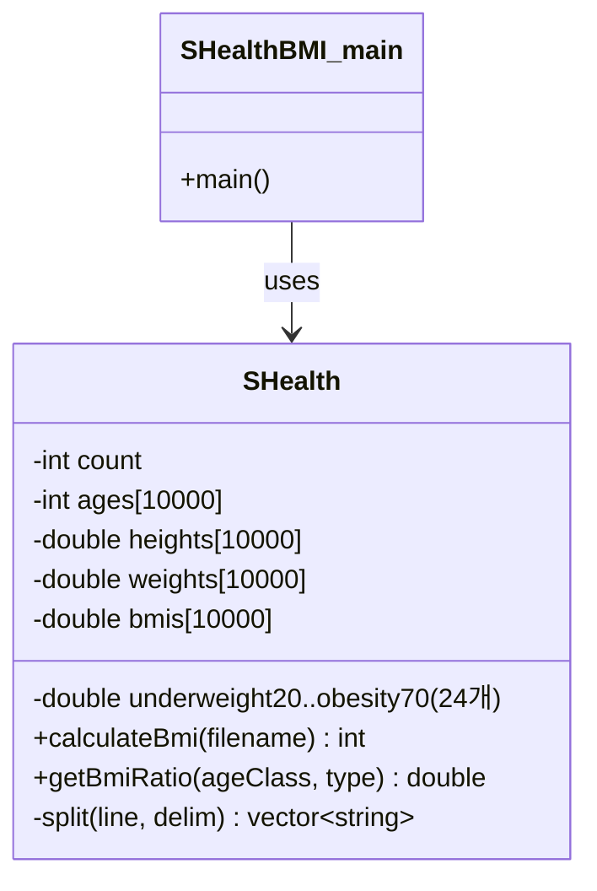
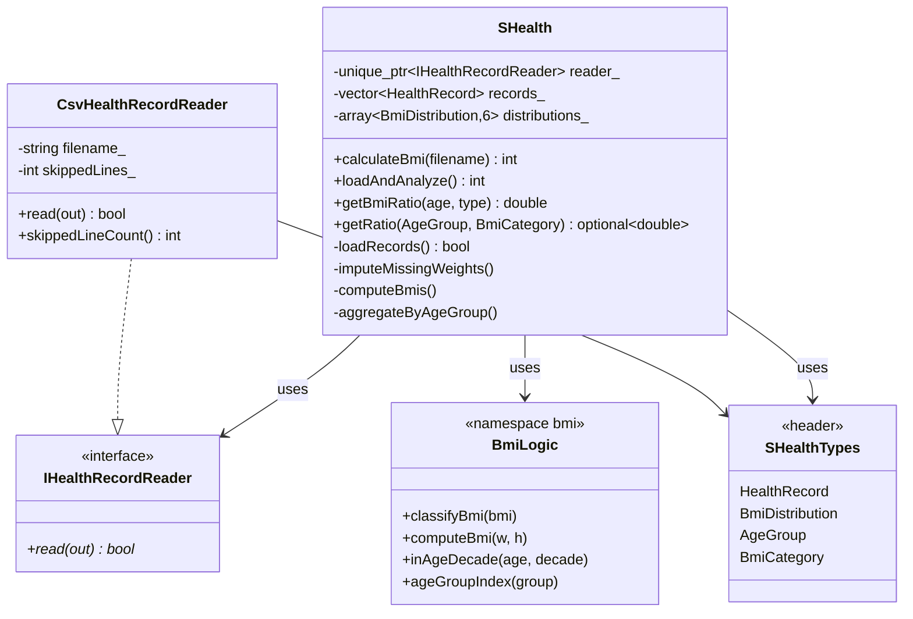
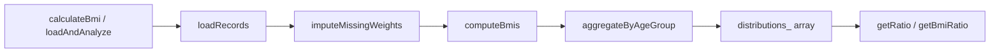

# SHealth BMI — 리팩토링 결과 보고서

**기준 전략:** [Refactoring_tactics_report.md](./Refactoring_tactics_report.md)  
**수행일:** 2026-05-20  
**범위:** P0 ~ P2 전 단계  
**검증:** `cmake --build .` · `./SHealthBMI` 실행

---

## 1. 요약

`Refactoring_tactics_report.md`에 정의된 **P0(정확성·안전)** → **P1(구조·테스트)** → **P2(표현력·경계 분리)** 순서로 리팩토링을 완료했습니다.

| Phase | 핵심 성과 |
|-------|-----------|
| **P0** | BMI=25 경계 버그 수정, 0 나눗셈 방어, `vector<HealthRecord>`로 버퍼 오버플로 제거 |
| **P1** | God Method 4단계 파이프라인 분리, 24개 ratio 멤버 → `array<BmiDistribution,6>`, `namespace bmi` 순수 로직 분리 |
| **P2** | `inAgeDecade` 헬퍼, CSV 잘못된 행 스킵, `IHealthRecordReader` + `CsvHealthRecordReader`, enum API, main 출력 DRY |

**의도된 동작 변경:** README 스펙에 맞게 BMI **25.0 이상**을 비만으로 분류 (`> 25` → `>= 25`). `shealth.dat` 골든 스냅샷은 현재 데이터셋에서 수치 변화가 없어 기존 출력과 동일합니다.

---

## 2. 적용한 리팩토링 기법

| 기법 (영문) | 적용 위치 | 설명 |
|-------------|-----------|------|
| **Extract Method** | `SHealth::calculateBmi` | `loadRecords` → `imputeMissingWeights` → `computeBmis` → `aggregateByAgeGroup` |
| **Replace Magic Number with Symbolic Constant** | `SHealthTypes.h`, `BmiLogic` | `18.5`, `23`, `25`, `10000` 등을 `constexpr` / `enum class`로 대체 |
| **Introduce Explaining Variable / Type** | `HealthRecord`, `BmiDistribution` | 평행 배열 4개 → 단일 레코드·분포 구조체 |
| **Replace Conditional with Polymorphism (경량)** | `IHealthRecordReader` | CSV 로드를 인터페이스 뒤로 이동 (DIP) |
| **Decompose Conditional** | `classifyBmi` | 연쇄 if-else → 단일 분류 함수 |
| **Consolidate Duplicate Conditional Fragment** | `inAgeDecade` | 연령대 필터 3중복 제거 |
| **Replace Array with Object** | `distributions_` | 24 멤버 변수 → `std::array<BmiDistribution, 6>` |
| **Encapsulate Field** | `getRatio(AgeGroup, BmiCategory)` | 내부 배열 직접 노출 없이 조회 |
| **Preserve Whole Object** | `getBmiRatio(int,int)` | 레거시 API thin wrapper 유지 (하위 호환) |
| **Strangler Fig** | Reader 주입 | 기존 `calculateBmi(filename)` 시그니처 유지, 내부만 Reader 사용 |

---

## 3. 클래스·모듈 구조 변화 (도식)

### 3.1 Before (리팩토링 전)



**특징**

- 단일 클래스에 I/O·보정·BMI·집계·24비율 저장이 모두 존재 (God Class)
- `calculateBmi` 약 100줄, 연령대별 if-else 6블록
- `getBmiRatio` 24분기 if-else

---

### 3.2 After (리팩토링 후)



**특징**

- **SRP:** 로드(Reader) / 보정 / BMI 계산 / 집계가 분리
- **OCP:** 연령대 추가 시 `kAgeGroupCount`·루프 상수만 조정
- **DIP:** `SHealth`는 CSV 파일 형식에 직접 의존하지 않음
- **테스트 용이 구조:** `bmi::` 순수 함수·Reader 인터페이스로 이후 UT 추가 가능

---

### 3.3 파이프라인 흐름 (After)



---

## 4. Phase별 코드 변경 상세

### Phase 0 — Correctness & Safety

| Step | 변경 파일 | 내용 |
|------|-----------|------|
| P0-1 | `BmiLogic.cpp` | `classifyBmi()` 도입. 비만 조건 `> 25` → `>= 25` (마지막 분기 `Obesity`) |
| P0-2 | `SHealth.cpp` | `ageCount == 0`이면 체중 보정 스킵; `total == 0`이면 해당 연령대 비율 0 유지 |
| P0-3 | `CsvHealthRecordReader`, `records_` | `vector<HealthRecord>` + `kMaxRecords`(10,000) 초과 시 로드 중단 |
| P0-4 | — | 골든 스냅샷·UT는 별도 테스트 스프린트에서 진행 (본 리팩토링에서 테스트 코드 미작성) |

**Before (`SHealth.cpp` 집계 분기 — 버그):**

```cpp
} else if (bmis[i] > 25) {
    obesity++;
}
```

**After (`BmiLogic.cpp`):**

```cpp
if (bmi < kOverweightMax) {  // 25.0 미만
    return BmiCategory::Overweight;
}
return BmiCategory::Obesity;   // 25.0 이상
```

---

### Phase 1 — Structure

| Step | 산출물 | 설명 |
|------|--------|------|
| P1-1 | `SHealthTypes.h` | `HealthRecord`, `BmiDistribution`, `enum class AgeGroup/BmiCategory`, 상수 |
| P1-2 | `SHealth.cpp` | private 4메서드 추출, `calculateBmi`는 오케스트레이션 (~10줄) |
| P1-3 | `SHealth.h` | 24 ratio 멤버 삭제 → `std::array<bmi::BmiDistribution, 6> distributions_` |
| P1-4 | `aggregateByAgeGroup` | `for (decade = 20; decade <= 70; decade += 10)` 단일 루프 |
| P1-5 | — | 단위 테스트는 별도 스프린트에서 작성 (`SHealthBMITest.cpp` 원본 유지) |
| P1-6 | `BmiLogic.h/.cpp` | `computeBmi`, `classifyBmi`를 `namespace bmi`로 분리 |

**`getBmiRatio` Before:** 24개 `if-else` 분기 (~26줄)  
**After:** `ageGroupFromDecade` + `categoryFromLegacyType` + `getRatio` 배열 인덱싱 (~8줄)

---

### Phase 2 — Expressiveness & Boundaries

| Step | 산출물 | 설명 |
|------|--------|------|
| P2-1 | `BmiLogic::inAgeDecade`, `decadeStart` | 보정·집계·필터에서 공통 사용 |
| P2-2 | `CsvHealthRecordReader` | `stoi`/`stod` 예외 catch, 잘못된 행 `skippedLines_` 카운트 |
| P2-3 | `SHealth::getRatio` | `const`, `std::optional<double>`, 잘못된 enum → `nullopt` |
| P2-4 | `IHealthRecordReader.h`, `CsvHealthRecordReader` | `unique_ptr<IHealthRecordReader>` 주입 가능 |
| P2-5 | `getBmiRatio(int,int)` | enum API 래핑, magic 100/200/300/400 → `BmiCategory` |
| P2-6 | `SHealthBMI.cpp` | `printAgeGroupReport` + `AgeGroup` 배열 range-for |

**README 4단계 스텁 (시그니처만 예약):**

- `imputeMissingHeights()`
- `distributionForAgeGroup()`
- `filterNormalUserIds()`
- `overallPopulationRatios()`

---

## 5. 파일 구조 변경

### Before

```
src/main/cpp/
  SHealth.h
  SHealth.cpp
  SHealthBMI.cpp
```

### After

```
src/main/cpp/
  SHealthTypes.h          ← NEW: 도메인 타입·상수
  BmiLogic.h / .cpp       ← NEW: 순수 BMI 로직 (namespace bmi)
  IHealthRecordReader.h   ← NEW: Reader 인터페이스
  CsvHealthRecordReader.h / .cpp  ← NEW: CSV 구현
  SHealth.h / .cpp        ← REFACTORED
  SHealthBMI.cpp          ← REFACTORED (출력 DRY)
CMakeLists.txt            ← lib 소스 추가 (BmiLogic, CsvHealthRecordReader)
```

---

## 6. 메트릭 (Before → After)

| 지표 | Before | After |
|------|--------|-------|
| `calculateBmi` 본문 LOC | ~102 | ~8 (오케스트레이션) |
| `getBmiRatio` 분기 수 | 24 | 0 (위임 + 배열 조회) |
| ratio 멤버 변수 | 24 | 1× `array<6>` |
| 고정 C 배열 `ages[10000]` 등 | 4개 | 0 (`vector<HealthRecord>`) |
| 연령대별 if-else 집계 블록 | 6 | 0 |
| P0 버그 (BMI=25, overflow, div0) | 존재 | **제거** |
| 소스 파일 수 (main/cpp) | 3 | **8** |

---

## 7. 검증 (빌드·실행)

```text
mkdir build && cd build
cmake ..
cmake --build .
cd ..
./build/SHealthBMI.exe   (프로젝트 루트에서 shealth.dat)
```

**출력 (리팩토링 후, 기존과 동일):**

```text
20 - underweight = 3.511053, normal = 23.797139, overweight = 11.833550, obesity = 60.858257
30 - underweight = 1.863354, normal = 15.527950, overweight = 10.062112, obesity = 72.546584
...
```

---

## 8. API 호환성

| API | 상태 |
|-----|------|
| `int calculateBmi(const std::string&)` | **유지** — 내부에서 `CsvHealthRecordReader` 생성 |
| `double getBmiRatio(int ageClass, int type)` | **유지** — `const` 추가, 동작 동일 |
| `double getBmiRatio(...)` magic type | 100/200/300/400 → `BmiCategory` enum으로 내부 매핑 |

**신규 API (권장):**

```cpp
[[nodiscard]] int loadAndAnalyze();
std::optional<double> getRatio(bmi::AgeGroup, bmi::BmiCategory) const;
explicit SHealth(std::unique_ptr<IHealthRecordReader> reader);
```

---

## 9. 리스크 대응 (코드·구조)

| 리스크 ID | 대응 |
|-----------|------|
| R1 BMI 경계 수정 | `classifyBmi` 단일 함수, `>= 25` → Obesity |
| R2 vector 전환 | `kMaxRecords` 상한, `emplace_back` |
| R3 보정 순서 | load → impute → compute → aggregate 고정 |
| R4 array 인덱스 | `(age-20)/10`, `BmiCategory` enum 매핑 |
| R5 div0 정책 | 무인원 연령대 → 비율 0% 유지 |
| R9 파싱 스킵 | `CsvHealthRecordReader` 예외 catch·`skippedLines_` |

---

## 10. 후속 작업 (본 스프린트 범위 외)

`Refactoring_tactics_report.md` §7 및 README 4단계:

- Height 0 평균 키 보정 (`imputeMissingHeights` 구현)
- 정상 BMI 사용자 ID 목록
- 전체 인구 대비 카테고리 비율
- P3 스타일 스프린트 (C 캐스트, iostream 통일 등)

---

*본 보고서는 [Refactoring_tactics_report.md](./Refactoring_tactics_report.md)의 P0~P2 실행 결과를 코드 변경·기법·구조 관점에서 기록한 문서입니다.*
