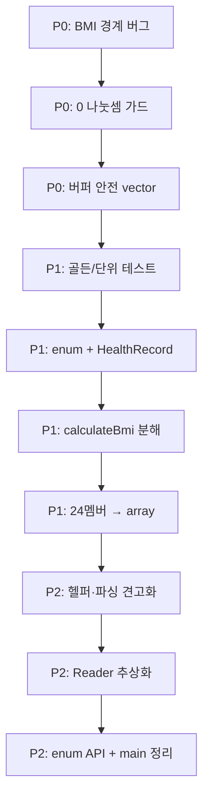

# SHealth BMI — Refactoring Tactics Report

**기준 문서:** [code_quality_report.md](./code_quality_report.md)  
**대상:** `src/main/cpp/SHealth.{h,cpp}`, `SHealthBMI.cpp`, `src/test/cpp/SHealthBMITest.cpp`  
**관점:** 시니어 C++ 아키텍트 · 모던 C++17 · SOLID · 안전한 점진적 리팩토링  
**작성일:** 2026-05-19

---

## 1. 전략 요약

| 원칙 | 내용 |
|------|------|
| **Correctness First** | P0에서 스펙 버그·UB·0 나눗셈을 먼저 고친 뒤 구조 변경 |
| **Characterization Tests** | P1 구조 리팩토링 직전, `shealth.dat` 기준 골든 출력/비율 TC를 최소 1건이라도 확보 |
| **Strangler Fig** | `calculateBmi()`를 한 번에 클래스 분리하지 않고, **함수 추출 → 데이터 통합 → API 교체** 순 |
| **Behavior-Preserving Steps** | 각 커밋/단계는 빌드·`ctest`·`./SHealthBMI` 출력 비교로 검증 |
| **README 로드맵 정렬** | P2까지 1~3단계(클린코드·UT), P3·4단계(Reader 분리·신기능)는 본 문서 범위 밖 별도 스프린트 |

**목표 상태 (P2 완료 시):**

- God Method → 4~6개의 단일 책임 free/static 함수 또는 private 메서드
- 24개 ratio 멤버 → `std::array<BmiDistribution, 6>`
- `enum class` 기반 조회 API (기존 `int` API는 deprecated 래퍼로 잠시 유지 가능)
- 핵심 로직 UT 10건+ (BMI·보정·분류·경계·예외)

---

## 2. 문제점 · 원칙 · 영향 · 개선 · 우선순위 (P0~P2)

| # | 문제점 | 위반 원칙 / 스멜 | 영향 | 개선 방향 | 우선순위 |
|---|--------|------------------|------|-----------|----------|
| 1 | `calculateBmi()` 100줄+, I/O·보정·BMI·집계 혼재 | **SRP**, **God Method**, **Long Method** | 회귀 위험↑, 단위 테스트 불가, 4단계 기능 추가 시 수정면 폭증 | `loadRecords` → `imputeMissingWeights` → `computeBmis` → `aggregateByAgeGroup` 파이프라인 분리; `calculateBmi`는 오케스트레이션만 | **P0** (버그 수정 후) / **P1** (본격 분리) |
| 2 | `ages[10000]` 등 고정 C 배열, `count++` 무검증 | **고정 배열 스멜**, 방어 코드 부재 | 10,000건 초과 시 **버퍼 오버플로 (UB)** | `std::vector<HealthRecord>` + `reserve(10'000)`; 로드 시 `size() >= capacity`면 중단·로그 | **P0** |
| 3 | `sum / ageCount`, `* 100 / sum`에서 0 나눗셈 | 방어적 프로그래밍 부재 | 연령대 무인원·전원 체중 0 시 **NaN/크래시** | `ageCount == 0` → 보정 스킵; `sum == 0` → 비율 0 또는 `std::nullopt`; 집계 전 가드 | **P0** |
| 4 | BMI 경계 `> 25` (스펙: **25 이상** 비만) | **스펙 불일치 버그** | BMI=25.0 미분류 → 합계·비율 왜곡 | `classifyBmi(double)` 단일 함수 + `constexpr` 임계값; `>= 25` → Obesity | **P0** |
| 5 | 연령대×카테고리 동일 if-else 6회 (76~106행) | **DRY**, **Shotgun Surgery**, **OCP** | 연령대 추가 시 6블록 이상 수정 | `std::array<BmiDistribution, 6>` + 루프 인덱스 `(a - 20) / 10` | **P1** |
| 6 | `getBmiRatio()` 24분기 if-else | **Switch 남용**, **Primitive Obsession** | 타입 코드 오용·분기 폭증 | 2D 배열/맵 O(1) 조회; `getRatio(AgeGroup, BmiCategory) const` | **P1** |
| 7 | ratio 멤버 24개 (`underweight20` …) | **Data Clumps**, **Duplicate Observed Data** | 헤더 비대, 초기화 누락 위험 | `struct BmiDistribution { double uw, normal, ow, ob; };` + `array<6>` | **P1** |
| 8 | 매직 넘버 `18.5`, `23`, `25`, `100/200/300/400`, `10000` | **Magic Number** | 오타·스펙 변경 시 누락 | `namespace bmi::threshold`, `enum class AgeGroup`, `enum class BmiCategory` | **P1** (P0 경계 수정과 동시에 상수화 권장) |
| 9 | 연령대 필터 `ages[i] >= a && ages[i] < a+10` 3회 중복 | **Duplicate Code** | 한 곳만 수정 시 불일치 | `inAgeDecade(int age, int decadeStart)` 또는 `AgeGroup decadeOf(int age)` | **P2** |
| 10 | `std::stoi`/`stod` 예외·범위 검사 없음 | **에러 처리 부재** | 잘못된 CSV 1줄로 **전체 중단** | try/catch 또는 `from_chars`; 실패 행 스킵 + 카운터; UT로 검증 | **P2** |
| 11 | CSV 파일 경로·형식에 `SHealth` 강결합 | **DIP**, 경계 분리 부재 | 4단계 DB/API 전환 시 전면 수정 | `IHealthRecordReader` + `CsvHealthRecordReader` (P2는 인터페이스 스케치만, 구현은 4단계) | **P2** |
| 12 | `getBmiRatio(int ageClass, int type)` | **Primitive Obsession** | `getBmiRatio(25, 999)` 등 오용 | enum API + 기존 int 시그니처 thin wrapper (deprecated 주석) | **P2** |
| 18 | `SHealthBMITest` `FAIL()` only | **테스트 부재** | 리팩토링 안전망 없음 | BMI·보정·분류·경계·빈 연령대 TC; README 3단계 TC 목록 충족 | **P1** (P0 직후 최소 골든 TC 권장) |

> **P3 항목** (C 캐스트, `file.close()`, printf 통일, const-correctness)는 P2 안정화 이후 별도 “스타일 스프린트”로 처리. 본 전술 문서의 실행 단계는 **P0~P2**에 집중한다.

---

## 3. 단계별 실행 계획 (P0 → P1 → P2)

### Phase 0 — Correctness & Safety (예상 0.5~1h)

**목표:** 동작 버그·UB 제거. **구조는 거의 유지** (리뷰어가 diff를 좁게 볼 수 있음).

| Step | 작업 | 산출물 | 완료 기준 |
|------|------|--------|-----------|
| P0-1 | `classifyBmi` / 경계 상수 추출, `> 25` → `>= 25` (또는 final `else`) | `SHealth.cpp` 내 static 함수 또는 anonymous namespace | BMI=18.5, 23, 25, 25.0001 수동/UT 검증 |
| P0-2 | 집계·보정 루프에 `ageCount > 0`, `sum > 0` 가드 | NaN 제거 | 연령대 데이터 0건인 synthetic 입력에서 크래시 없음 |
| P0-3 | 로드 루프에 `count < 10000` (임시) 또는 즉시 `vector` + `emplace_back` | 오버플로 방지 | 10,001번째 레코드 시 정의된 동작(거부/에러) |
| P0-4 | (권장) `shealth.dat` 스냅샷 1건: 6개 연령대 4비율 **골든 값** 기록 | 테스트 또는 주석 fixture | P1 리팩토링 전후 출력 일치 |

**P0에서 하지 않을 것:** 24 멤버 일괄 삭제, Reader 인터페이스 도입, public API 시그니처 변경 — 회귀 추적을 어렵게 함.

---

### Phase 1 — Structure & Test Harness (예상 1.5~2.5h)

**목표:** SRP·DRY·OCP를 데이터 중심 설계로 전환. README 2~3단계(함수 추출·중복 제거·UT) 충족.

| Step | 작업 | 산출물 | 완료 기준 |
|------|------|--------|-----------|
| P1-1 | `HealthRecord`, `BmiDistribution`, `enum class` 도입 (`SHealthTypes.h` 등) | 헤더 분리 | 컴파일, 기존 main 동작 동일 |
| P1-2 | `calculateBmi` → 4 private 메서드 추출 (동일 public 시그니처 유지) | `SHealth.cpp` | 각 함수 30줄 이하 목표 |
| P1-3 | 24 ratio 멤버 → `std::array<BmiDistribution, 6> distributions_` | `SHealth.h` 슬림화 | `getBmiRatio`가 배열 인덱싱으로 24분기 제거 |
| P1-4 | 집계 루프 단일화: `for (a = 20; a <= 70; a += 10)` 한 블록 | DRY | 연령대 추가 시 배열 크기·상수만 변경 |
| P1-5 | Google Test: BMI 공식, 체중 0 보정, 분류 경계, 빈 연령대 | `SHealthBMITest.cpp` | `ctest` green, `FAIL()` 제거 |
| P1-6 | (선택) `computeBmi`, `classifyBmi`를 `SHealth` 밖 namespace `bmi::`로 이동 | 테스트 용이 | 로직 UT가 파일 I/O 없이 실행 |

**P1 API 정책:**

- `int calculateBmi(const std::string&)` / `double getBmiRatio(int,int)` **유지** → `SHealthBMI.cpp` 변경 최소화.
- 내부만 `getRatio(AgeGroup, BmiCategory)` 사용.

---

### Phase 2 — Expressiveness & Boundaries (예상 1~2h)

**목표:** 모던 C++ 표현력·경계 스케치. README 4단계(SRP 분리·신기능)의 **토대**만 마련.

| Step | 작업 | 산출물 | 완료 기준 |
|------|------|--------|-----------|
| P2-1 | `inAgeDecade`, `decadeStart(AgeGroup)` 헬퍼로 필터 3중복 제거 | 유틸 함수 | 동일 집계 결과 |
| P2-2 | CSV 파싱: 잘못된 행 스킵, `invalid_argument` 처리 | 견고한 로드 | 깨진 1줄 포함 fixture UT |
| P2-3 | `getRatio(...) const`, `[[nodiscard]] loadAndAnalyze`, `std::optional<double>` 조회 | 명확한 계약 | 잘못된 enum/연령대 → nullopt |
| P2-4 | `IHealthRecordReader` 인터페이스 + `CsvHealthRecordReader` | `IHealthRecordReader.h` | `SHealth`가 reader 주입(생성자 또는 setter) |
| P2-5 | `getBmiRatio(int,int)` → enum API 래핑; magic type 100/200/300/400 → `BmiCategory` | 하위 호환 | main 변경 없이 빌드 |
| P2-6 | `SHealthBMI.cpp`: `printAgeGroupReport` + range-for (6회 printf 제거) | 출력 DRY | stdout 포맷 동일 |

**P2에서 4단계 기능은 “스텁만”:**

- Height 0 보정, 정상 사용자 목록, 전체 비율 → **인터페이스/메서드 시그니처 예약**, 구현은 다음 스프린트.

---

## 4. 실행 순서 (의존성)

**병렬 가능:** P0-1(경계)와 P0-2(0 나눗셈)는 동일 파일이지만 독립 패치 가능. **P1-3(24→array)는 P1-2(함수 추출) 이후**가 안전 (한 번에 상태 구조를 바꾸지 않음).

---

## 5. 리팩토링 리스크 분석

### 5.1 리스크 매트릭스

| ID | 리스크 | 발생 단계 | 가능성 | 심각도 | 완화 전략 |
|----|--------|-----------|--------|--------|-----------|
| R1 | BMI 경계 수정으로 **기존 출력 수치 변경** (버그 fix) | P0 | 높음 | 중 | README 스펙을 SSOT로 문서화; 경계값 UT; 이전 출력과 diff 시 “의도된 수정” 명시 |
| R2 | `vector` 전환 시 **메모리 레이아웃·인덱싱 버그** | P0~P1 | 중 | 높음 | 소량 synthetic 데이터 UT; 로드 직후 `size()==count` 불변식 |
| R3 | 함수 추출 중 **보정 순서 변경** (연령대 루프 의존) | P1 | 중 | 높음 | 추출 전후 `shealth.dat` 6×4 비율 비교; 보정→BMI→집계 순서 고정 |
| R4 | 24 멤버 → array 시 **`getBmiRatio` 인덱스 매핑 오류** | P1 | 중 | 높음 | `(age-20)/10`, `(type-100)/100 매핑 UT; 24 조합 spot check |
| R5 | 0 나눗셈 가드로 **무인원 연령대 비율이 0 vs NaN** 정책 불일치 | P0 | 중 | 중 | 제품 정책 결정(0% vs “N/A”); main printf와 합의 |
| R6 | 테스트 없이 대규모 diff → **silent regression** | P1 | 높음 | 높음 | P0-4 골든 TC; P1-5에서 경계·보정 필수 TC |
| R7 | enum API 도입 시 **기존 magic number 호출 깨짐** | P2 | 낮 | 중 | int wrapper 유지; `static_assert` 매핑 테이블 |
| R8 | Reader 분리 시 **이중 소유·수명** (reader vs SHealth) | P2 | 중 | 중 | `unique_ptr<IHealthRecordReader>` 기본 구현 CSV; 명시적 소멸 순서 |
| R9 | 파싱 스킵 정책으로 **count 감소** → 비율 변화 | P2 | 중 | 중 | 스킵 건수 로깅; UT fixture에 bad line |
| R10 | CMake/헤더 분리로 **include 순환** | P1~P2 | 낮 | 중 | `SHealthTypes.h`는 의존성 없음; `SHealth.h`는 forward declare 최소화 |

### 5.2 단계별 “하지 말아야 할 것”

| 단계 | 금지 패턴 | 이유 |
|------|-----------|------|
| P0 | God Method 분리 + API 변경 동시 | 버그 원인 추적 불가 |
| P0 | 경계 수정 없이 vector만 도입 | 잘못된 비율을 “정확한 구조”로 고정 |
| P1 | public API 전면 `optional`/`enum` 교체 | main·외부 호출 깨짐 |
| P1 | 테스트 없이 24 멤버 삭제 | 컴파일은 되나 값 매핑 오류 잔존 |
| P2 | Reader + Height0 보정 + 신기능 동시 | SRP 목표이나 범위 폭발 |
| P2 | `from_chars` 전면 도입과 예외 정책 혼용 | C++17 컴파일러별 가용성 이슈 (필요 시 `stoi`+try 유지) |

### 5.3 검증 체크리스트 (각 Phase Gate)

| Gate | 명령 | Pass 조건 |
|------|------|-----------|
| G0 | `cmake --build . && ./SHealthBMI` | 크래시 없음; 6줄 출력 finite |
| G0 | 경계 UT | 18.5, 23, 25, 25.0 분류 일치 README |
| G1 | `ctest` | 전체 green, `FAIL()` 없음 |
| G1 | 골든 비교 | `shealth.dat` 연령대별 4비율 허용오차 ε (예: 1e-6) — P0 버그 수정 시 baseline 갱신 |
| G2 | 잘못된 CSV fixture | 프로세스 생존, 부분 결과 |
| G2 | `nm` / 링크 | 테스트 바이너리에 main 중복 없음 (기존 CMake 구조 유지) |

---

## 6. 권장 커밋 단위 (리뷰·롤백 용이)

1. `fix: BMI boundary at 25 and guard division by zero`
2. `refactor: use vector<HealthRecord> with capacity limit`
3. `test: add golden and classification unit tests`
4. `refactor: extract load/impute/compute/aggregate from calculateBmi`
5. `refactor: replace 24 ratio members with array<BmiDistribution,6>`
6. `refactor: simplify getBmiRatio via enum indexing`
7. `feat: robust CSV parsing and AgeGroup helpers`
8. `refactor: introduce IHealthRecordReader and tidy main output`

---

## 7. P2 이후 확장 (참고 — 본 문서 범위 외)

README 4단계 기능은 P2에서 쌓은 **모듈 경계** 위에 추가한다.

| 기능 | 권장 배치 클래스/함수 |
|------|----------------------|
| Height 0 → 연령대 평균 키 보정 | `imputeMissingHeights` (체중 보정과 대칭) |
| 특정 연령대 BMI 분포 | `AgeGroupStatistics::distribution(AgeGroup)` |
| 정상 BMI 사용자 ID 목록 | `BmiCalculator::filterNormal(records)` |
| 전체 대비 카테고리 비율 | `PopulationStatistics::overall()` |

---

## 8. 기대 메트릭 (Before → After P2)

| 지표 | Before | After P2 (목표) |
|------|--------|-----------------|
| `calculateBmi` LOC | ~100 | ~15 (오케스트레이션) |
| `getBmiRatio` 분기 | 24 | 0~2 (bounds check) |
| ratio 멤버 변수 | 24 | 1× `array<6>` |
| 실질 UT | 0 | ≥10 |
| if-else 연령대 블록 | 6 | 0 |
| P0 버그 (BMI=25, overflow, div0) | 존재 | 제거 |

---

## 9. 즉시 실행 권고 (Next Actions)

1. **오늘:** P0-1 ~ P0-3 적용 + BMI=25 경계 UT 1건.  
2. **다음 커밋:** P0-4 골든 스냅샷 또는 `shealth.dat` 기대값 fixture.  
3. **이후 스프린트:** P1-2 → P1-3 순으로 구조 변경, P1-5 테스트를 P1-3 **직전**에 넣어도 됨 (테스트 우선 전략).

---

*본 문서는 `code_quality_report.md`의 분석을 실행 가능한 전술(P0~P2 단계·리스크·표)로 구체화한 것입니다. P3 스타일 정리는 P2 Gate 통과 후 진행합니다.*
