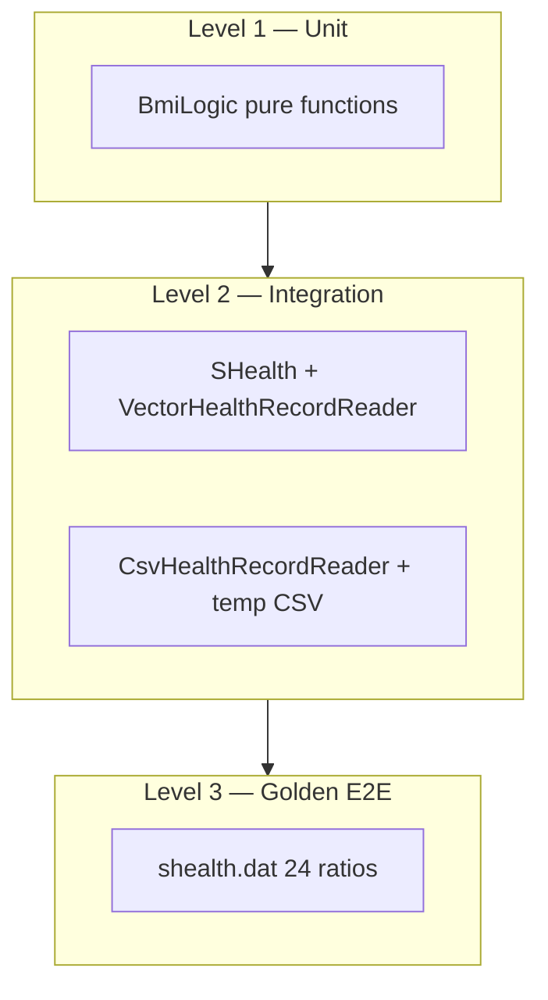

# SHealth BMI — 테스트 계획 보고서

**문서 역할:** 리팩토링된 코드에 대한 QA 테스트 계획 (요구사항 분석 + TC 상세 설계)  
**기준 문서:** [README.md](../README.md), [Refactoring_result_report.md](./Refactoring_result_report.md)  
**구현 대상:** `src/test/cpp/SHealthBMITest.cpp`, `ctest`  
**작성일:** 2026-05-20  
**상태:** 리팩토링(P0~P2) 완료 · 단위 테스트 미구현(`FAIL()` 스텁)

---

## 1. 문서 목적

README 비즈니스 요구사항과 리팩토링 결과를 기준으로, **리팩토링된 코드가 문제없이 동작하는지** 검증하기 위한 테스트 계획을 정의한다. 본 문서는 다음을 포함한다.

- 입력 **경계값 분석(BVA)** 및 동치 분할
- TC-ID별 **Given-When-Then** 명세와 기대값
- **골든 스냅샷** (`shealth.dat`) 회귀 기준
- Google Test 구현·실행 가이드

---

## 2. 테스트 목표

| 목표 | 설명 |
|------|------|
| **정확성** | BMI 공식, 4분류 경계(특히 25.0), 체중 0 보정, 연령대별 비율 집계 |
| **안전성** | 0 나눗셈·버퍼 오버플로·잘못된 CSV로 인한 크래시 없음 |
| **회귀 방지** | `shealth.dat` 기준 24개 비율 수치 고정 |
| **구조 검증** | `load → impute → compute → aggregate` 파이프라인 순서 유지 |
| **README 3단계** | BMI 계산·체중 보정·분류·예외 TC 구현 후 `ctest` 통과 |

---

## 3. 테스트 범위

### 3.1 In Scope

| 영역 | 검증 대상 |
|------|-----------|
| Unit | `bmi::computeBmi`, `classifyBmi`, `inAgeDecade`, enum 매핑 |
| Integration | `SHealth` + Mock `IHealthRecordReader` (보정·집계·API) |
| Component | `CsvHealthRecordReader` (fixture CSV) |
| Golden | `shealth.dat` 전체 파이프라인 6연령대 × 4비율 |

### 3.2 Out of Scope (README 4단계 — 스텁)

| 기능 | 비고 |
|------|------|
| `imputeMissingHeights()` | height=0 보정 — 구현 후 TC-P2 활성화 |
| `filterNormalUserIds()` | ID 미저장 상태 |
| `overallPopulationRatios()` | 스펙 미확정 |

### 3.3 부동소수점 허용 오차 (전 TC 공통)

| 비교 대상 | ε | Google Test |
|-----------|---|-------------|
| BMI 값 | `1e-4` | `EXPECT_NEAR(actual, expected, 1e-4)` |
| 비율(%) | `1e-5` | `EXPECT_NEAR(..., 1e-5)` |
| 4비율 합 | `1e-3` | `EXPECT_NEAR(sum, 100.0, 1e-3)` |

---

## 4. 테스트 전략

### 4.1 테스트 피라미드



### 4.2 격리 원칙

| 계층 | I/O | Reader |
|------|-----|--------|
| Unit | 없음 | — |
| Integration | 없음 | `VectorHealthRecordReader` (테스트 헤더) |
| CSV Component | 임시 파일 | `CsvHealthRecordReader` |
| Golden | `shealth.dat` | `calculateBmi` 또는 Reader |

### 4.3 파이프라인 회귀 포인트

순서 변경 시 골든이 깨지므로 **통합 TC에서 파이프라인 전체**를 검증한다.

```text
loadRecords → imputeMissingWeights → computeBmis → aggregateByAgeGroup
```

---

## 5. 입력 경계값 분석 (BVA)

### 5.1 BMI 분류 경계 (`classifyBmi`)

README: ≤18.5 저체중 · (18.5, 23) 정상 · [23, 25) 과체중 · ≥25 비만  
구현: `<= 18.5` / `< 23` / `< 25` / else Obesity

| 구간 | 유효 경계 (on-point) | 무효/인접 (off-point) | 기대 분류 |
|------|----------------------|------------------------|-----------|
| 저체중 | 18.5 | 18.5 − ε | Underweight / Normal |
| 정상 하한 | 18.5 + ε | 18.5 | Normal |
| 정상 상한 | 22.999… | 23.0 | Normal / Overweight |
| 과체중 하한 | 23.0 | 22.999… | Overweight |
| 과체중 상한 | 24.999… | 25.0 | Overweight / Obesity |
| 비만 하한 | **25.0** (P0 회귀) | 24.999… | **Obesity** / Overweight |
| 극단 | 0.0, 100.0 | — | Underweight, Obesity |

**ε 권장:** `std::nextafter(18.5, 2.0)` 등 — 플랫폼 독립적 인접값.

### 5.2 BMI 계산 입력 (`computeBmi`)

| 변수 | 정상 | 경계·특수 | 위험 동작 |
|------|------|-----------|-----------|
| **weight (kg)** | 50~100 | 0, 0.1, 매우 큰 값 | 0 → BMI 0 (보정 전) |
| **height (cm)** | 150~180 | **0**, 0.1, 300 | **height=0 → 0 나눗셈 (inf/nan)** |
| **조합** | 70, 170 → 24.2215 | 동일 키·체중으로 분류 경계 BMI 역산 | — |

**역산 예 (경계 BMI → 필요 체중, height=170cm):**

| 목표 BMI | weight ≈ (BMI × 1.7²) kg |
|----------|---------------------------|
| 18.5 | 53.435 |
| 23.0 | 66.503 |
| 25.0 | 72.25 |

### 5.3 연령대 필터 (`inAgeDecade`, decade=20)

| age | in 20대? | 집계 |
|-----|----------|------|
| 19 | false | 제외 |
| **20** | **true** | 포함 (하한 on-point) |
| 29 | true | 포함 (상한 on-point) |
| **30** | **false** | 30대로 넘어감 |
| 79 | true (70대) | 포함 |
| **80** | **false** | 제외 |

### 5.4 체중 누락 보정 (`imputeMissingWeights`)

| 시나리오 | 20대 레코드 (age, weight) | 유효 n | 평균 | 보정 후 weight |
|----------|---------------------------|--------|------|----------------|
| 정상 보정 | (25,30), (25,0), (25,60) | 2 | 45 | 0→45 |
| 단일 유효 | (25,50), (25,0) | 1 | 50 | 0→50 |
| 전원 0 | (25,0), (25,0) | 0 | — | 0 유지 (div0 방지) |
| 타 연령대 혼합 | (25,40), (35,0) | 20대만 | 40 | 20대 0만 40 |
| 보정 대상 없음 | (25,55) | — | — | 변경 없음 |

### 5.5 CSV 입력 (`CsvHealthRecordReader`)

| 입력 조건 | 기대 |
|-----------|------|
| 정상 4열 | 레코드 적재, `skippedLines_=0` |
| 열 < 4 | 스킵, `skippedLines_++` |
| age/weight/height 비숫자 | 스킵 |
| 빈 데이터(헤더만) | `read=true`, size=0 |
| 파일 없음 | `read=false` |
| 빈 줄 | 무시 |
| **10,000건** | 10,000건 로드 |
| **10,001번째** | 10,000에서 중단, stderr 로그 |

### 5.6 API 조회 경계

| `getBmiRatio(ageClass, type)` | 기대 |
|-------------------------------|------|
| (20, 100)~(20, 400) | 해당 연령대 비율 |
| (25, 200) | 0.0 (잘못된 연령대) |
| (20, 999) | 0.0 (잘못된 type) |
| 무인원 연령대 | 0.0 |

---

## 6. 테스트 케이스 상세 명세

### 6.1 Unit — `BmiLogic` (`TEST(BmiLogic, ...)`)

#### TC-U-01: 표준 BMI 계산

| 항목 | 내용 |
|------|------|
| **Given** | weight=70 kg, height=170 cm |
| **When** | `computeBmi(70, 170)` |
| **Then** | `24.221453` (±1e-4) |

#### TC-U-02: BMI 분류 경계 7점 (P0)

| # | Input BMI | Then `classifyBmi` |
|---|-----------|-------------------|
| 1 | 18.5 | Underweight |
| 2 | nextafter(18.5, 100) | Normal |
| 3 | 22.999 | Normal |
| 4 | 23.0 | Overweight |
| 5 | 24.999 | Overweight |
| 6 | **25.0** | **Obesity** |
| 7 | nextafter(25.0, 100) | Obesity |

#### TC-U-03: 극단 BMI 분류

| Input | Then |
|-------|------|
| 0.0 | Underweight |
| 50.0 | Obesity |

#### TC-U-04: `inAgeDecade` 경계

| age | decade | Then |
|-----|--------|------|
| 19 | 20 | false |
| 20 | 20 | true |
| 29 | 20 | true |
| 30 | 20 | false |
| 79 | 70 | true |
| 80 | 70 | false |

#### TC-U-05: enum 매핑

| Function | Input | Then |
|----------|-------|------|
| `ageGroupFromDecade` | 20,70 | has_value |
| `ageGroupFromDecade` | 25 | nullopt |
| `categoryFromLegacyType` | 100~400 | 매핑 일치 |
| `categoryFromLegacyType` | 999 | nullopt |
| `ageGroupIndex(Decade20)` | — | 0 |
| `ageGroupIndex(Decade70)` | — | 5 |

#### TC-U-06: height=0 계산 (결함 기록용)

| Given | When | Then (현행) |
|-------|------|----------------|
| weight=70, height=0 | `computeBmi` | inf 또는 nan — **정책 확정 전 `@Disabled` 또는 문서화된 기대** |

---

### 6.2 Integration — `SHealth` + Mock Reader

테스트 헤더 `src/test/cpp/TestFixtures.h`에 `VectorHealthRecordReader` 배치 권장.

#### TC-I-01: 체중 0 연령대 평균 보정

| 항목 | 내용 |
|------|------|
| **Given** | records: `{25,30,170}`, `{25,0,170}`, `{25,60,170}` |
| **When** | `loadAndAnalyze()` |
| **Then** | weight=0 레코드 → 45 kg; `computeBmi` 후 3건 모두 동일 BMI |

#### TC-I-02: 연령대 전원 weight=0 (div0 방어)

| Given | When | Then |
|-------|------|------|
| `{25,0,170}` × 2 | `loadAndAnalyze()` | 크래시 없음; 20대 비율 전부 0 또는 집계 0 |

#### TC-I-03: 단일 연령대 100% 한 카테고리

| Given | When | Then |
|-------|------|------|
| 20대 2명, BMI 모두 Normal (예: w=65,h=170) | analyze | `getRatio(Decade20, Normal)` ≈ 100, 나머지 ≈ 0 |

#### TC-I-04: 4비율 합 ≈ 100%

| Given | When | Then |
|-------|------|------|
| TC-I-03 fixture | `getRatio` 4종 | sum ≈ 100 (±1e-3) |

#### TC-I-05: 19세·80세 집계 제외

| Given | When | Then |
|-------|------|------|
| `{19,70,170}`, `{25,70,170}` | analyze | 20대 total=1 (19세만 제외) |

#### TC-I-06: 잘못된 API → 0

| When | Then |
|------|------|
| `getBmiRatio(99, 200)` | 0.0 |
| `getBmiRatio(20, 999)` | 0.0 |
| `getRatio` invalid enum | nullopt |

#### TC-I-07: Reader 미설정

| Given | When | Then |
|-------|------|------|
| default `SHealth`, `loadAndAnalyze()` | — | return 0 |

#### TC-I-08: `distributionForAgeGroup`

| Given | When | Then |
|-------|------|------|
| TC-I-03 | `distributionForAgeGroup(Decade20)` | 4필드 합 ≈ 100 |

---

### 6.3 Component — `CsvHealthRecordReader`

fixture 디렉터리: `src/test/fixtures/` (CMake에서 복사 또는 `CMAKE_SOURCE_DIR` 경로 사용)

#### TC-C-01: 정상 CSV

```csv
id,age,weight,height
1,25,70.0,170.0
```

| Then | size=1, age=25, weight=70, height=170 |

#### TC-C-02: 잘못된 행 스킵

```csv
id,age,weight
bad,line,xx,yy,zz
2,30,60.0,165.0
```

| Then | size=1, `skippedLineCount()>=2` |

#### TC-C-03: 파일 없음

| Then | `read` → false |

#### TC-C-04: 빈 파일(헤더만)

| Then | `read` → true, size=0 |

#### TC-C-05: 10,001 레코드 상한

| Given | 10,001행 유효 데이터 CSV |
| Then | size == 10000 |

---

### 6.4 Golden — `shealth.dat` 회귀

#### TC-G-01: 전체 연령대 비율 스냅샷

**전제:** `ctest` 실행 시 working directory = 프로젝트 루트 (`shealth.dat` 접근 가능).  
CMake 권장:

```cmake
gtest_discover_tests(SHealthBMITest
  WORKING_DIRECTORY ${CMAKE_SOURCE_DIR})
```

| 연령대 | underweight | normal | overweight | obesity |
|--------|-------------|--------|------------|---------|
| 20 | 3.511053 | 23.797139 | 11.833550 | 60.858257 |
| 30 | 1.863354 | 15.527950 | 10.062112 | 72.546584 |
| 40 | 0.521512 | 10.039113 | 9.126467 | 80.312907 |
| 50 | 2.181401 | 12.629162 | 9.988519 | 75.200918 |
| 60 | 0.862895 | 8.533078 | 10.642378 | 79.961649 |
| 70 | 0.529101 | 12.345679 | 10.758377 | 76.366843 |

| 항목 | 내용 |
|------|------|
| **Given** | 프로젝트 루트 `shealth.dat` |
| **When** | `SHealth::calculateBmi("shealth.dat")` |
| **Then** | return > 0; 위 24값 `EXPECT_NEAR` (ε=1e-5) |

#### TC-G-02: 로드 건수

| Then | `calculateBmi` 반환값 == 실제 레코드 수 (>0) |

#### TC-G-03: main 실행 (선택, CI)

| When | `SHealthBMI` subprocess | Then | exit 0, stdout 6줄 파싱 일치 |

---

### 6.5 비기능

| TC-ID | 검증 |
|-------|------|
| TC-NF-01 | `cmake .. && cmake --build .` 성공 |
| TC-NF-02 | `cd build && ctest` 전체 PASS |
| TC-NF-03 | `FAIL()` 스텁 제거 |

---

## 7. 테스트 데이터·Fixture 설계

### 7.1 Mock Reader (통합 TC 공통)

```cpp
// src/test/cpp/TestFixtures.h
class VectorHealthRecordReader : public IHealthRecordReader {
public:
    explicit VectorHealthRecordReader(std::vector<bmi::HealthRecord> data)
        : data_(std::move(data)) {}
    bool read(std::vector<bmi::HealthRecord>& out) override {
        out = data_;
        return true;
    }
private:
    std::vector<bmi::HealthRecord> data_;
};

inline bmi::HealthRecord makeRecord(int age, double weight, double height) {
    return bmi::HealthRecord{age, weight, height, 0.0};
}
```

### 7.2 권장 fixture 파일

| 파일 | 용도 |
|------|------|
| `valid_single.csv` | TC-C-01 |
| `invalid_rows.csv` | TC-C-02 |
| `empty_data.csv` | TC-C-04 |
| `max_records.csv` | TC-C-05 (생성 스크립트) |

### 7.3 `SHealthBMITest.cpp` 구조 (권장)

```text
TEST(BmiLogic, ComputeBmi_Standard)
TEST(BmiLogic, ClassifyBmi_Boundaries)      // TC-U-02 Parameterized
TEST(BmiLogic, InAgeDecade_Boundaries)
TEST(SHealthIntegration, ImputeWeight_Average)
TEST(SHealthIntegration, ImputeWeight_AllZero_NoCrash)
TEST(SHealthIntegration, Ratios_SumTo100)
TEST(CsvReader, SkipInvalidRows)
TEST(Golden, ShealthDat_AllAgeGroupRatios)  // TC-G-01
```

Parameterized 예:

```cpp
class ClassifyBmiBoundaryTest : public ::testing::TestWithParam<std::tuple<double, bmi::BmiCategory>> {};
TEST_P(ClassifyBmiBoundaryTest, ClassifiesAtBoundary) {
    auto [bmi, expected] = GetParam();
    EXPECT_EQ(bmi::classifyBmi(bmi), expected);
}
INSTANTIATE_TEST_SUITE_P(Boundaries, ClassifyBmiBoundaryTest,
    ::testing::Values(
        std::make_tuple(18.5, bmi::BmiCategory::Underweight),
        std::make_tuple(25.0, bmi::BmiCategory::Obesity),
        // ...
    ));
```

---

## 8. TC 우선순위·실행 순서

| 우선순위 | TC-ID | 이유 | 예상 공수 |
|----------|-------|------|-----------|
| **P0** | TC-U-02, TC-G-01 | BMI=25 회귀·골든 | 0.5일 |
| **P0** | TC-I-02 | div0·전원 0 보정 | 0.25일 |
| **P1** | TC-U-01,04,05 / TC-I-01,04,06 | README 3단계 | 0.5일 |
| **P1** | TC-C-01~05 | CSV 안전 | 0.25일 |
| **P2** | TC-U-06, TC-G-03 | 정책·E2E | 후순위 |
| **보류** | TC-P2-* | README 4단계 구현 후 | — |

**권장 구현 순서:** P0 Unit 경계 → P0 Golden → P1 Integration → P1 CSV → 정리

---

## 9. 수용 기준 (Definition of Done)

| # | 기준 |
|---|------|
| AC-01 | `cd build && ctest` **전체 통과** (`FAIL()` 제거) |
| AC-02 | **TC 20건 이상** (Unit 10+ / Integration 6+ / Golden 1+ / CSV 3+) |
| AC-03 | TC-U-02 **25.0 → Obesity** 필수 포함 |
| AC-04 | TC-G-01 **24비율** 골든 일치 (ε=1e-5) |
| AC-05 | TC명·fixture로 Given-When-Then 추적 가능 |
| AC-06 | `WORKING_DIRECTORY`로 `shealth.dat` 경로 안정화 |

---

## 10. 리스크·미결정 사항

| ID | 리스크 | 대응 |
|----|--------|------|
| R-T01 | `FAIL()`만 존재 → 회귀 무방비 | P0 TC 즉시 구현 |
| R-T02 | height=0 → inf/nan | TC-U-06: 4단계 전 `@Disabled` 또는 정책 TC |
| R-T03 | 골든 flaky | ε 고정, `EXPECT_NEAR` 통일 |
| R-T04 | ctest CWD | `WORKING_DIRECTORY ${CMAKE_SOURCE_DIR}` |
| R-T05 | `imputeMissingWeights` private | Mock Reader + `loadAndAnalyze()` 공개 API로 검증 |
| R-T06 | 19·80세 제외 | TC-I-05로 현행 동작 고정 |

| # | 미결정 | 영향 TC |
|---|--------|---------|
| Q-01 | height=0 정책 | TC-U-06, 4단계 |
| Q-02 | 19·80세 비즈니스 규칙 | TC-I-05 |
| Q-03 | ID 저장 여부 | filterNormalUserIds |
| Q-04 | 음수 age/weight CSV | 추가 BVA (현재 stoi/stod 동작 그대로 TC화) |

---

## 11. 요구사항 추적 매트릭스 (요약)

| README / BR | 대표 TC |
|-------------|---------|
| BR-01 연령대별 4비율 | TC-G-01, TC-I-04 |
| BR-02 체중 0 보정 | TC-I-01, TC-I-02 |
| BR-04 BMI 공식 | TC-U-01 |
| BR-05 분류 경계 | TC-U-02, TC-U-03 |
| README 3단계 UT | TC-U-* , TC-I-* |
| NF ctest | TC-NF-02 |

---

## 12. 요약

- **핵심 검증:** BMI 경계(특히 **25.0**), 체중 0 연령대 평균 보정, 6연령대 골든 24비율.
- **경계값:** §5에 BMI·연령·체중·CSV·API 5축 BVA 정의; §6에 **실행 가능한 TC 명세** 30건 이상.
- **구조적 이점:** `namespace bmi` 순수 함수 + `IHealthRecordReader` 주입으로 Unit/Integration 분리 용이.
- **다음 작업:** `TestFixtures.h` 추가 → `SHealthBMITest.cpp` P0 TC 구현 → CMake `WORKING_DIRECTORY` 설정 → `ctest` green.

---

*본 문서는 요구사항 분석과 테스트 계획을 통합한 QA 입력 문서이며, TC 구현 시 TC-ID를 테스트 이름에 반영할 것을 권장한다 (예: `ClassifyBmi_TC_U_02_Boundary25`).*
