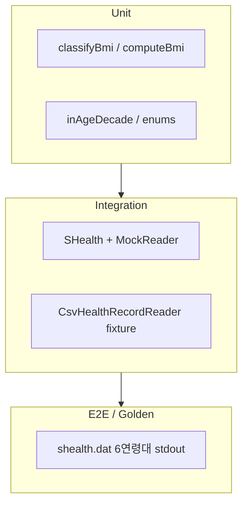

# SHealth BMI — 테스트 요구사항 분석 보고서

**문서 역할:** QA·테스트 설계 관점의 요구사항 분해  
**기준 문서:** [README.md](../README.md), [Refactoring_result_report.md](./Refactoring_result_report.md)  
**대상 코드:** `src/main/cpp/`, `src/test/cpp/SHealthBMITest.cpp`  
**작성일:** 2026-05-20  
**상태:** 리팩토링(P0~P2) 완료 후, 단위 테스트 미구현(`FAIL()` 스텁)

---

## 1. 문서 목적

본 보고서는 README에 명시된 **비즈니스·기능 요구사항**을 테스터가 검증 가능한 형태로 분해하고, 리팩토링된 코드베이스에 대해 **무엇을·어떤 순서로·어떤 기준으로** 테스트해야 하는지 정리합니다. 이후 `SHealthBMITest.cpp` TC 설계, 골든 스냅샷 정의, `ctest` 통과 기준 수립의 입력 문서로 사용합니다.

---

## 2. 테스트 범위

### 2.1 In Scope (본 스프린트)

| 영역 | 설명 |
|------|------|
| **도메인 로직** | BMI 계산, BMI 4분류, 연령대(10년 단위) 필터, 체중 0 보정, 연령대별 비율 집계 |
| **순수 함수** | `namespace bmi` — `computeBmi`, `classifyBmi`, `inAgeDecade` 등 |
| **오케스트레이션** | `SHealth::loadAndAnalyze` 파이프라인 (Reader 주입 가능 시 I/O 격리) |
| **CSV 로드** | `CsvHealthRecordReader` — 정상 파싱, 잘못된 행 스킵, 레코드 상한 |
| **회귀** | `shealth.dat` 기준 6개 연령대 × 4비율 출력(골든 스냅샷) |
| **README 3단계** | UT: BMI 계산, 체중 보정, 분류, 예외·경계 |

### 2.2 Out of Scope (별도 스프린트 — README 4단계)

| 기능 | 현재 상태 | 비고 |
|------|-----------|------|
| Height 0 → 연령대 평균 키 보정 | `imputeMissingHeights()` 스텁 | 요구사항은 README 4단계에만 명시 |
| 정상 BMI 사용자 ID 목록 | `filterNormalUserIds()` 스텁 | 스펙·출력 형식 미정의 |
| 전체 인구 대비 카테고리 비율 | `overallPopulationRatios()` 스텁 | 집계 단위(전체 vs 연령대) 명확화 필요 |
| 특정 연령대 BMI 분포 API | `distributionForAgeGroup()` 구현됨, main 미사용 | API 단위 TC는 가능 |

### 2.3 비기능 요구사항 (빌드·실행)

| ID | 요구사항 | 검증 방법 |
|----|----------|-----------|
| NF-01 | CMake 3.10+, C++17 | `cmake ..` 성공 |
| NF-02 | Google Test 자동 Fetch | `SHealthBMITest` 빌드 |
| NF-03 | `ctest`로 테스트 실행 | CI/로컬 `cd build && ctest` |
| NF-04 | `./SHealthBMI` + `shealth.dat` | 프로젝트 루트에서 실행, exit 0 |
| NF-05 | 최대 10,000건 로드 | 10,001번째 레코드 시 중단·로그 |

---

## 3. 비즈니스 요구사항 (BR)

| ID | 요구사항 (README) | 테스트 관점 해석 |
|----|-------------------|------------------|
| BR-01 | 삼성 헬스 수집 데이터로 **연령대별** 저체중/정상/과체중/비만 **통계(비율)** 산출 | 출력은 % 단위 4값, 연령대 20·30·40·50·60·70 |
| BR-02 | **체중 0**은 누락으로 간주, **같은 연령대 평균 체중**으로 대체 후 BMI·집계 | 보정은 집계 전 1회; 0이 아닌 값만 평균에 포함 |
| BR-03 | 입력: ID, 나이, 체중(kg), 키(cm) | CSV 4열; 현재 `HealthRecord`에는 ID 미저장 → ID 기반 기능(4단계) 테스트 시 구조 확장 필요 |
| BR-04 | BMI = 체중(kg) / 키(m)² | 키는 cm → m 변환(`/100`) 필수 |
| BR-05 | BMI 구간: ≤18.5 저체중, (18.5, 23) 정상, [23, 25) 과체중, **≥25 비만** | 경계값이 핵심 회귀 포인트(P0 수정) |

---

## 4. 기능 요구사항 (FR) — 검증 가능 명세

### 4.1 BMI 계산 (`bmi::computeBmi`)

| ID | 조건 | 기대 결과 |
|----|------|-----------|
| FR-BMI-01 | weight=70, height=170 | BMI ≈ 70 / (1.7²) ≈ 24.2215 (허용 오차 ε 정의 필요, 예: 1e-4) |
| FR-BMI-02 | height=0 | **미정의** — README 미언급; 현재는 0 나눗셈·inf 가능 → **결함 후보**로 별도 TC·정책 결정 |
| FR-BMI-03 | weight=0 (보정 전) | 보정 로직과 연계; 단독 `computeBmi`는 0 반환 |

### 4.2 BMI 분류 (`bmi::classifyBmi`)

README 문구: *「18.5이하 저체중, 18.5초과 23미만 정상, 23이상 25미만 과체중, 25이상 비만」*

구현(`BmiLogic.cpp`)과의 대응:

| BMI 값 | README 해석 | 구현 (`classifyBmi`) | 일치 |
|--------|-------------|----------------------|------|
| 18.5 | 저체중 (이하) | `<= 18.5` → Underweight | ✅ |
| 18.5001 | 정상 (초과) | `< 23` → Normal | ✅ |
| 23.0 | 과체중 (이상) | `< 25`이 false, `>= 23` 구간 → Overweight | ✅ (`23 <= bmi < 25`) |
| 25.0 | 비만 (이상) | Obesity | ✅ (P0: `>= 25`) |
| 24.999… | 과체중 | Overweight | ✅ |

**경계 TC 필수 세트:** `{18.5, 18.5+ε, 23.0, 23.0+ε, 25.0, 25.0+ε}`

### 4.3 연령대 (`bmi::inAgeDecade`)

| ID | 규칙 | 예시 |
|----|------|------|
| FR-AGE-01 | 20대: `age >= 20 && age < 30` | 20 포함, 30 미포함 |
| FR-AGE-02 | 70대: `age >= 70 && age < 80` | 79 포함, 80 미포함 |
| FR-AGE-03 | 19, 80 등 | 해당 연령대 집계 **제외** (README 미명시 → 현재 구현 기준 문서화) |

### 4.4 체중 누락 보정 (`SHealth::imputeMissingWeights`)

| ID | 조건 | 기대 동작 |
|----|------|-----------|
| FR-IMP-W-01 | 연령대 내 weight≠0인 레코드만 평균 산출 | 예: 20대 (25kg, 0, 75kg) → 평균 50kg |
| FR-IMP-W-02 | weight==0인 동 연령대 레코드에 평균 대입 | 보정 후 BMI 재계산 대상 |
| FR-IMP-W-03 | 연령대 내 유효 체중 0건 (`ageCount==0`) | 보정 스킵, 0 유지 |
| FR-IMP-W-04 | 연령대 전원 weight==0 | 평균 분모 0 → 보정 스킵 (0 나눗셈 방지) |
| FR-IMP-W-05 | 보정 순서 | `loadRecords` → **impute** → `computeBmis` → `aggregate` (순서 변경 시 회귀) |

### 4.5 연령대별 비율 집계 (`aggregateByAgeGroup`)

| ID | 규칙 | 기대 |
|----|------|------|
| FR-AGG-01 | 연령대별 인원 `total` | `inAgeDecade` 만족 레코드 수 |
| FR-AGG-02 | 각 카테고리 비율 | `count / total * 100.0` (백분율) |
| FR-AGG-03 | `total == 0` | 해당 연령대 distribution 0 유지, `getBmiRatio` → 0 |
| FR-AGG-04 | 4비율 합 | 이론상 100% (반올림·부동소수점은 ε 허용) |
| FR-AGG-05 | 연령대 외 레코드 | 집계에 미포함 |

### 4.6 조회 API

| API | FR | 기대 |
|-----|-----|------|
| `getBmiRatio(20, 100)` | FR-API-01 | 20대 저체중 비율; type 100/200/300/400 |
| `getBmiRatio(25, 200)` | FR-API-02 | 잘못된 연령대 → **0.0** (legacy) |
| `getRatio(AgeGroup, BmiCategory)` | FR-API-03 | 유효 조합 → `optional` 값; 무효 → `nullopt` |
| `calculateBmi(path)` | FR-API-04 | 성공 시 로드 건수 `> 0` 반환; 실패 시 `<= 0`, main exit 1 |

### 4.7 CSV 로드 (`CsvHealthRecordReader`)

| ID | 조건 | 기대 |
|----|------|------|
| FR-CSV-01 | 헤더 1행 스킵 | 데이터만 적재 |
| FR-CSV-02 | 열 수 < 4, 파싱 예외 | 행 스킵, `skippedLines_` 증가 |
| FR-CSV-03 | 파일 없음 | `read` false, `loadAndAnalyze` → 0 |
| FR-CSV-04 | 레코드 ≥ 10,000 | 추가 로드 중단, stderr 로그 |
| FR-CSV-05 | ID 컬럼 | 파싱만 하고 **미저장** — ID 기반 FR은 4단계 전제 |

---

## 5. README Activities ↔ 테스트 매핑

| 단계 | README 목표 | 테스트 산출물 | 현재 충족 |
|------|-------------|---------------|-----------|
| 1 | 코드 스멜·BMI 로직 이해 | 요구사항 본 문서 | — |
| 2 | 클린코드 리팩토링 | 구조 변경 회귀 TC(골든) | 리팩토링 완료, TC 없음 |
| **3** | **UnitTest** | BMI·보정·분류·예외 TC | ❌ `FAIL()` only |
| 4 | 기능 개선 | Height 보정·ID 목록·전체 비율 | 스텁만 존재 |
| 5 | 회고 | 커버리지·TC 팁 | 미착수 |

### 5.1 README 3단계 — 필수 TC 카테고리

| 카테고리 | 대상 | 최소 시나리오 수(권장) |
|----------|------|------------------------|
| BMI 계산 | `bmi::computeBmi` | 3+ (표준, 소수, 극단) |
| 체중 보정 | `imputeMissingWeights` (통합 또는 friend/주입) | 4+ (FR-IMP-W-01~04) |
| BMI 분류 | `bmi::classifyBmi` | 6+ (경계 전부) |
| 예외·경계 | Reader, 빈 파일, 빈 연령대, 잘못된 API | 5+ |
| 골든 회귀 | `shealth.dat` 전체 파이프라인 | 1 (24개 수치 또는 6줄 stdout) |

---

## 6. 골든 출력 기준 (회귀)

`Refactoring_result_report.md` §7 기록값 — `shealth.dat` 실행 시 **허용 기준**으로 사용:

```text
20 - underweight = 3.511053, normal = 23.797139, overweight = 11.833550, obesity = 60.858257
30 - underweight = 1.863354, normal = 15.527950, overweight = 10.062112, obesity = 72.546584
40 - underweight = ...
50 - ...
60 - ...
70 - ...
```

| 검증 유형 | 방법 |
|-----------|------|
| **E2E 스냅샷** | `SHealthBMI` stdout 6줄 문자열 비교 (또는 파싱 후 24개 double) |
| **API 스냅샷** | `getBmiRatio(decade, category)` 24회 호출, 부동소수점 `EXPECT_NEAR(..., 1e-5)` |
| **실패 시** | P0 경계·보정 순서·데이터 필터 버그 우선 의심 |

> 주의: 골든 값은 **현재 데이터셋 + 현재 스펙(≥25 비만)** 기준입니다. 스펙·데이터 변경 시 스냅샷 갱신이 정당합니다.

---

## 7. 구현 대비 갭·테스트 리스크

| 리스크 | 설명 | 테스트 대응 |
|--------|------|-------------|
| **R-T01** | 단위 테스트 부재 | P1 완료 후에도 `FAIL()` — 리팩토링 회귀 안전망 없음 |
| **R-T02** | ID 미저장 | 4단계 `filterNormalUserIds` 요구 시 Reader·`HealthRecord` 확장 TC 필요 |
| **R-T03** | height=0 정책 미정 | README 4단계 전까지 **명시적 결함 TC** 또는 스킵 정책 문서화 |
| **R-T04** | 부동소수점 | 비율·BMI 비교 시 ε 통일 (권장: BMI 1e-4, 비율 1e-5) |
| **R-T05** | 테스트와 I/O 결합 | `IHealthRecordReader` 목(mock) 주입으로 CSV 없이 FR-IMP·FR-AGG 검증 |
| **R-T06** | 19세·80세 사용자 | 비즈니스 요구 미정 — “집계 제외”를 현행 동작으로 고정 TC화 |
| **R-T07** | P0 BMI=25 수정 | 경계 TC 없으면 재발 가능 — `classifyBmi(25.0)==Obesity` 필수 |

---

## 8. 테스트 설계 전략 (권장)

### 8.1 피라미드



### 8.2 격리 원칙

| 계층 | 도구 | 비고 |
|------|------|------|
| Unit | `TEST(BmiLogic, ...)` | 파일 I/O 없음 |
| Integration | `SHealth(mock_reader)` | 소규모 `vector<HealthRecord>` 인메모리 |
| Golden | 실제 `shealth.dat` | 경로: CMake `WORKING_DIRECTORY` 또는 fixture 복사 |

### 8.3 Mock Reader 스케치 (FR 검증용)

```cpp
class VectorHealthRecordReader : public IHealthRecordReader {
public:
    explicit VectorHealthRecordReader(std::vector<bmi::HealthRecord> data)
        : data_(std::move(data)) {}
    bool read(std::vector<bmi::HealthRecord>& out) override {
        out = data_;
        return true;
    }
private:
    std::vector<bmi::HealthRecord> data_;
};
```

---

## 9. 테스트 케이스 매트릭스 (초안)

### 9.1 P0 — 반드시 먼저 (Correctness)

| TC-ID | 요약 | 연관 FR |
|-------|------|---------|
| TC-P0-01 | `classifyBmi(25.0)` → Obesity | FR-BMI 분류, BR-05 |
| TC-P0-02 | 경계 6점 (18.5, 23, 25) | FR-BMI 분류 |
| TC-P0-03 | 연령대 전원 weight=0 → 크래시 없음 | FR-IMP-W-04, FR-AGG-03 |
| TC-P0-04 | `shealth.dat` 20대 4비율 골든 | FR-AGG, 골든 |
| TC-P0-05 | 10,001 레코드 → 상한 동작 | NF-05, FR-CSV-04 |

### 9.2 P1 — README 3단계

| TC-ID | 요약 | 연관 FR |
|-------|------|---------|
| TC-P1-01 | `computeBmi` 표준 케이스 | FR-BMI-01 |
| TC-P1-02 | 20대 체중 보정 산술 | FR-IMP-W-01,02 |
| TC-P1-03 | 보정 후 BMI·분류 일관성 | FR-IMP + FR-BMI |
| TC-P1-04 | `inAgeDecade` 경계 20,29,30 | FR-AGE |
| TC-P1-05 | 잘못된 CSV 행 스킵 | FR-CSV-02 |
| TC-P1-06 | `getBmiRatio(99,999)` → 0 | FR-API-02 |
| TC-P1-07 | 연령대 4비율 합 ≈ 100 | FR-AGG-04 |

### 9.3 P2 — 4단계(후속)

| TC-ID | 요약 | 전제 |
|-------|------|------|
| TC-P2-01 | height=0 연령대 평균 보정 | `imputeMissingHeights` 구현 |
| TC-P2-02 | 정상 BMI ID 목록 | ID 필드 저장 |
| TC-P2-03 | 전체 인구 4비율 | `overallPopulationRatios` 스펙 확정 |

---

## 10. 수용 기준 (Definition of Done)

README 3단계·실습 완료를 테스트 관점에서 정의하면 다음과 같습니다.

| # | 기준 |
|---|------|
| AC-01 | `cd build && ctest` **전체 통과** (`FAIL()` 제거) |
| AC-02 | BMI 경계·보정·분류 **단위 TC 10건 이상** (전술 문서 P1-5 목표) |
| AC-03 | `shealth.dat` 골든 **24비율 또는 6줄 stdout** 일치 |
| AC-04 | 신규 TC는 **Given-When-Then** 또는 명확한 fixture 이름으로 유지보수 가능 |
| AC-05 | (선택) 4단계 스텁 구현 시 본 문서 §9.3 TC 활성화 |

---

## 11. 미결정 사항 (테스트 설계 전 확인 권장)

| # | 질문 | 영향 |
|---|------|------|
| Q-01 | height=0일 때 BMI·집계 정책은? (4단계 전 예외 TC 여부) | FR-BMI-02 |
| Q-02 | 19세 이하·80세 이상 데이터는 제외가 맞는가? | FR-AGE, 골든 해석 |
| Q-03 | ID를 `HealthRecord`에 보관할 것인가? | 4단계 TC |
| Q-04 | 전체 인구 비율 vs 연령대별 합산 관계 | TC-P2-03 |
| Q-05 | 골든 비교 ε (고정값 vs ULP) | flaky 방지 |

---

## 12. 요약

- **핵심 검증 대상**은 README BR-01~05: 연령대별 BMI 4분류 **비율**, 체중 0 **연령대 평균 보정**, BMI **공식·경계(특히 25.0)**.
- 리팩토링으로 로직은 `bmi::` 순수 함수 + 4단계 파이프라인으로 **테스트하기 좋은 구조**가 되었으나, **`SHealthBMITest`는 아직 요구사항을 전혀 검증하지 않음**.
- **즉시 착수 우선순위:** P0 경계·골든 스냅샷 → P1 보정·분류 단위 TC → Mock Reader 통합 TC → (후속) README 4단계 스펙 확정 후 §9.3.

---

*다음 문서 제안: `Test_case_specification.md` (TC-ID별 Given/When/Then·fixture·기대값 상세) — 본 요구사항 분석을 입력으로 작성.*
